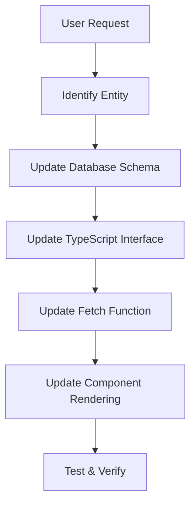
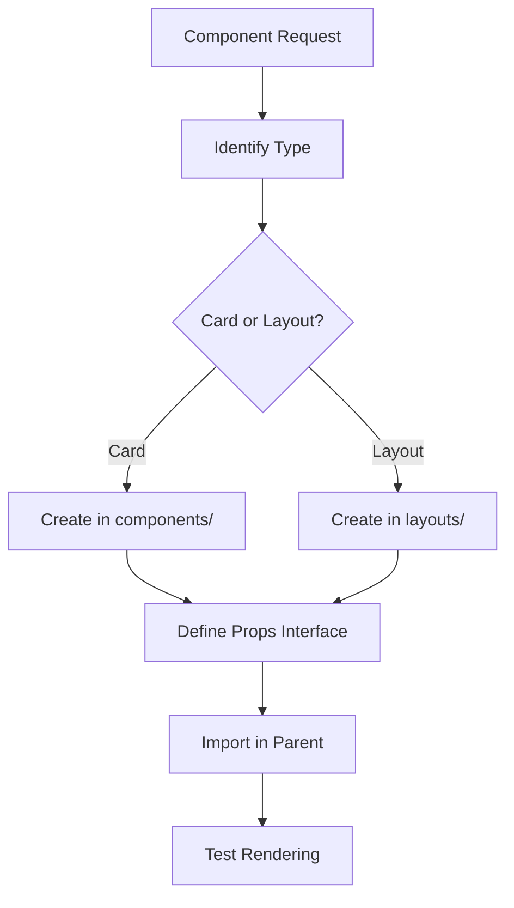
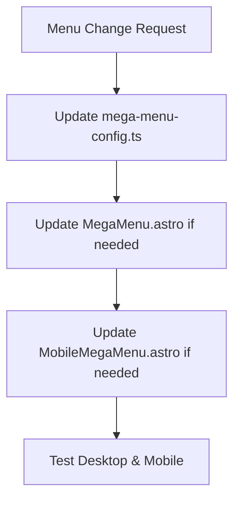

# PANDUAN DEVELOPMENT UNTUK AI - KOTACOM.ID PROJECT

## 🤖 PANDUAN KHUSUS UNTUK AI ASSISTANT

Dokumentasi ini dirancang khusus untuk AI assistant yang akan membantu development project kotacom.id. Berisi workflow, pattern, dan best practices yang harus diikuti.

---

## 📋 QUICK START CHECKLIST

### Langkah Pertama Saat Handle Project Ini:

1. **✅ Baca file-file kunci**:
   ```bash
   # Urutan prioritas membaca:
   1. PROJECT_DOCUMENTATION.md (overview lengkap)
   2. package.json (dependencies & scripts)
   3. src/lib/supabase-direct.ts (data layer)
   4. src/consts.ts (constants)
   5. astro.config.mjs (build config)
   ```

2. **✅ Pahami struktur data**:
   - Semua entity menggunakan prefix konsisten
   - Data dinormalisasi dari MDX + Supabase
   - Junction tables untuk many-to-many relations

3. **✅ Identifikasi task type**:
   - Content update → Edit Supabase atau MDX
   - UI changes → Edit components
   - New features → Follow entity creation pattern
   - Bug fixes → Check troubleshooting guide

---

## 🔄 WORKFLOW PATTERNS

### Pattern 1: Menambah Field Baru ke Entity



**Step-by-step**:
1. **Database**: ALTER table di Supabase
2. **Interface**: Update `SupabaseXXX` interface
3. **Fetch**: Update `getXXXDirectFromSupabase` function
4. **Component**: Update rendering di card/page components
5. **Test**: `npm run dev` → verify data shows

### Pattern 2: Membuat Component Baru



**Step-by-step**:
1. **Location**: `src/components/` atau `src/layouts/`
2. **Props**: Define TypeScript interface
3. **Template**: Follow existing component patterns
4. **Import**: Add ke parent component
5. **Test**: Verify rendering works

### Pattern 3: Update Navigation/Menu



**Files to check**:
- `src/data/mega-menu-config.ts`
- `src/components/MegaMenu.astro`
- `src/components/MobileMegaMenu.astro`

---

## 🎯 COMMON TASKS & SOLUTIONS

### Task 1: "Tambahkan field X ke posts"

**Template Response**:
```typescript
// 1. Database (di Supabase SQL Editor)
ALTER TABLE posts ADD COLUMN field_name text;

// 2. Interface Update (src/lib/supabase-direct.ts)
export interface SupabasePost {
  // ... existing fields
  field_name?: string;
}

// 3. Fetch Function Update
// Di getPostsDirectFromSupabase, tambah ke return object:
return {
  ...post,
  field_name: post.field_name || '',
  // ... other fields
};

// 4. Component Update (jika perlu display)
// Di PostCard.astro atau layout yang relevan
```

### Task 2: "Buat component baru untuk menampilkan X"

**Template File Structure**:
```astro
<!-- src/components/NewComponent.astro -->
---
interface Props {
  title: string;
  data?: any[];
  className?: string;
}

const { title, data = [], className = '' } = Astro.props;
---

<div class={`component-wrapper ${className}`}>
  <h2 class="text-2xl font-bold mb-4">{title}</h2>
  {data.map((item) => (
    <div class="item">
      <!-- Item rendering -->
    </div>
  ))}
</div>

<style>
  .component-wrapper {
    /* Component styles */
  }
</style>
```

### Task 3: "Update homepage untuk menampilkan Y"

**Files to check**:
1. `src/pages/index.astro` - Homepage structure
2. `src/components/Homepage/` - Homepage components
3. Create new component jika belum ada
4. Import dan tambahkan ke homepage

### Task 4: "Fix broken images/links"

**Debug steps**:
1. Check image URLs di Supabase data
2. Verify CDN configuration
3. Check ResponsiveImage component
4. Test image optimization script

---

## 🔍 DEBUGGING WORKFLOW

### Debug Step 1: Identify Issue Type

```typescript
// Data Issues
if (noDataShowing) {
  // Check: Supabase connection, RLS policies, environment vars
}

// UI Issues  
if (layoutBroken) {
  // Check: Component imports, Tailwind classes, responsive design
}

// Build Issues
if (buildFails) {
  // Check: TypeScript errors, missing imports, config issues
}
```

### Debug Step 2: Check Logs

```bash
# Development logs
npm run dev
# Look for console.log messages in browser

# Build logs
npm run build
# Check for TypeScript/Astro errors

# Supabase connection test
curl -H "apikey: $SUPABASE_ANON_KEY" "$SUPABASE_URL/rest/v1/posts?select=id&limit=1"
```

### Debug Step 3: Common Fixes

| Issue | Quick Fix |
|-------|-----------|
| TypeScript errors | Update interfaces di `supabase-direct.ts` |
| Missing imports | Add import statements |
| Styling issues | Check Tailwind classes, dark mode variants |
| Data not showing | Verify RLS policies, check console logs |
| Build failures | Run `npm run lint:fix` |

---

## 📝 CODE TEMPLATES

### Template 1: New Entity Fetch Function

```typescript
export async function getNewEntitiesDirectFromSupabase(
  limit: number = 10000,
  status: 'published' | 'draft' | 'all' = 'published'
): Promise<any[]> {
  try {
    console.log(`🔄 Fetching ${limit} new_entities from Supabase with status: ${status}...`);
    
    let query = supabase
      .from('new_entities')
      .select('*')
      .order('published', { ascending: false });

    if (status !== 'all') {
      query = query.eq('status', status);
    }

    const { data, error } = await query.limit(limit);

    if (error) {
      console.error('❌ Supabase error:', error);
      return [];
    }

    console.log(`✅ Successfully fetched ${data?.length || 0} new_entities`);
    return data || [];
  } catch (error) {
    console.error('❌ Error fetching from Supabase:', error);
    return [];
  }
}
```

### Template 2: New Card Component

```astro
---
// src/components/NewEntityCard.astro
interface Props {
  entity: any;
  className?: string;
}

const { entity, className = '' } = Astro.props;

// Normalize data if needed
const normalizedEntity = {
  title: entity.title || entity.neTitle || '',
  slug: entity.slug || entity.neSlug || '',
  description: entity.description || entity.neDescription || '',
  imageUrl: entity.imageUrl || entity.neImageUrl || '',
  published: entity.published || entity.nePublished || '',
};
---

<article class={`bg-white dark:bg-gray-800 rounded-lg shadow-md hover:shadow-lg transition-shadow duration-300 ${className}`}>
  {normalizedEntity.imageUrl && (
    <div class="aspect-video overflow-hidden rounded-t-lg">
      
    </div>
  )}
  
  <div class="p-6">
    <h3 class="text-xl font-semibold mb-2 text-gray-900 dark:text-white">
      <a href={`/new-entities/${normalizedEntity.slug}`} class="hover:text-blue-600 dark:hover:text-blue-400">
        {normalizedEntity.title}
      </a>
    </h3>
    
    {normalizedEntity.description && (
      <p class="text-gray-600 dark:text-gray-300 mb-4 line-clamp-3">
        {normalizedEntity.description}
      </p>
    )}
    
    <div class="flex items-center justify-between text-sm text-gray-500 dark:text-gray-400">
      {normalizedEntity.published && (
        <time datetime={normalizedEntity.published}>
          {new Date(normalizedEntity.published).toLocaleDateString('id-ID')}
        </time>
      )}
      
      <a 
        href={`/new-entities/${normalizedEntity.slug}`}
        class="text-blue-600 dark:text-blue-400 hover:underline font-medium"
      >
        Selengkapnya →
      </a>
    </div>
  </div>
</article>
```

### Template 3: Homepage Latest Component

```astro
---
// src/components/Homepage/LatestNewEntities.astro
import { getNewEntitiesDirectFromSupabase } from "../../lib/supabase-direct";
import NewEntityCard from "../NewEntityCard.astro";

interface Props {
  limit: number;
}

const { limit } = Astro.props;

// Fetch data
const entities = await getNewEntitiesDirectFromSupabase(limit);

// Normalize data (if needed)
const normalizedEntities = entities.map((entity) => ({
  ...entity,
  // Add normalization logic here
}));
---

<section class="bg-white dark:bg-gray-900">
  <div class="py-8 px-4 mx-auto max-w-screen-xl sm:py-16 lg:px-6">
    <div class="max-w-screen-md mb-8">
      <h2 class="mb-4 text-4xl tracking-tight font-extrabold text-gray-900 dark:text-white">
        Latest New Entities
      </h2>
      <p class="text-gray-500 sm:text-xl dark:text-gray-400">
        Description of what these entities are about.
      </p>
    </div>
    
    <div class="grid grid-cols-1 md:grid-cols-2 lg:grid-cols-3 gap-6">
      {normalizedEntities.map((entity) => (
        <NewEntityCard entity={entity} />
      ))}
    </div>
    
    <div class="text-center mt-8">
      <a 
        href="/new-entities" 
        class="inline-flex items-center px-6 py-3 text-sm font-medium text-center text-white bg-blue-700 rounded-lg hover:bg-blue-800 focus:ring-4 focus:outline-none focus:ring-blue-300 dark:bg-blue-600 dark:hover:bg-blue-700 dark:focus:ring-blue-800"
      >
        Lihat Semua
        <svg class="w-4 h-4 ml-2" fill="none" stroke="currentColor" viewBox="0 0 24 24">
          <path stroke-linecap="round" stroke-linejoin="round" stroke-width="2" d="M9 5l7 7-7 7"></path>
        </svg>
      </a>
    </div>
  </div>
</section>
```

---

## 🚨 CRITICAL PATTERNS TO FOLLOW

### 1. **ALWAYS Use Existing Patterns**
```typescript
// ✅ GOOD: Follow existing function patterns
export async function getNewEntitiesDirectFromSupabase(
  limit: number = 10000,
  status: 'published' | 'draft' | 'all' = 'published'
): Promise<any[]> {
  // Same pattern as other functions
}

// ❌ BAD: Create completely different patterns
function fetchNewEntities() {
  // Different pattern confuses codebase
}
```

### 2. **ALWAYS Normalize Data**
```typescript
// ✅ GOOD: Consistent normalization
const normalizedData = supabaseData.map((item) => ({
  neTitle: item.title,
  neSlug: item.slug,
  neDescription: item.description,
  // ... consistent prefix
}));

// ❌ BAD: Inconsistent field names
const data = supabaseData.map((item) => ({
  name: item.title,  // Different field name
  url: item.slug,    // Different field name
  // ... inconsistent
}));
```

### 3. **ALWAYS Include Error Handling**
```typescript
// ✅ GOOD: Proper error handling
try {
  const { data, error } = await supabase.from('table').select('*');
  if (error) {
    console.error('❌ Supabase error:', error);
    return [];
  }
  return data || [];
} catch (error) {
  console.error('❌ Error fetching data:', error);
  return [];
}

// ❌ BAD: No error handling
const { data } = await supabase.from('table').select('*');
return data; // Could be undefined
```

### 4. **ALWAYS Use TypeScript Interfaces**
```typescript
// ✅ GOOD: Define proper interfaces
interface Props {
  title: string;
  optional?: boolean;
}

const { title, optional = false } = Astro.props;

// ❌ BAD: No type safety
const { title, optional } = Astro.props; // No types
```

---

## 🛠️ STEP-BY-STEP WORKFLOWS

### Workflow 1: Adding New Field to Existing Entity

**Example**: "Tambahkan field `excerpt` ke posts"

```bash
# Step 1: Database Update (Supabase SQL Editor)
ALTER TABLE posts ADD COLUMN excerpt text;
UPDATE posts SET excerpt = LEFT(description, 160) WHERE excerpt IS NULL;

# Step 2: TypeScript Interface (src/lib/supabase-direct.ts)
export interface SupabasePost {
  // ... existing fields
  excerpt?: string;
}

# Step 3: Fetch Function Update
# Di getPostsDirectFromSupabase, tambah ke mapping:
return {
  ...post,
  excerpt: post.excerpt || post.description?.slice(0,160) || '',
  // ... other fields
};

# Step 4: Component Update (jika perlu display)
# Di PostCard.astro atau layout yang relevan, tambah:
{post.excerpt && (
  <p class="text-gray-600 dark:text-gray-300 mb-2">
    {post.excerpt}
  </p>
)}

# Step 5: Test
npm run dev
# Verify field shows in components
```

### Workflow 2: Creating New Entity Type

**Example**: "Buat entity baru untuk testimonials"

```bash
# Step 1: Database Schema (Supabase)
CREATE TABLE testimonials (
  id bigserial PRIMARY KEY,
  title text NOT NULL,
  slug text UNIQUE NOT NULL,
  content text,
  client_name text,
  client_position text,
  client_company text,
  rating integer DEFAULT 5,
  published timestamptz DEFAULT now(),
  status text DEFAULT 'published',
  created_at timestamptz DEFAULT now(),
  updated_at timestamptz DEFAULT now()
);

# Enable RLS
ALTER TABLE testimonials ENABLE ROW LEVEL SECURITY;
CREATE POLICY "Public testimonials" ON testimonials 
FOR SELECT USING (status = 'published');

# Step 2: TypeScript Interface
export interface SupabaseTestimonial {
  id: string;
  title?: string;
  slug?: string;
  content?: string;
  client_name?: string;
  client_position?: string;
  client_company?: string;
  rating?: number;
  published?: string;
  status?: string;
  created_at?: string;
  updated_at?: string;
}

# Step 3: Fetch Function
export async function getTestimonialsDirectFromSupabase(
  limit: number = 10000,
  status: 'published' | 'draft' | 'all' = 'published'
): Promise<SupabaseTestimonial[]> {
  // Follow existing pattern...
}

# Step 4: Card Component
<!-- src/components/TestimonialCard.astro -->

# Step 5: Homepage Component
<!-- src/components/Homepage/LatestTestimonials.astro -->

# Step 6: Detail Layout
<!-- src/layouts/TestimonialPage.astro -->

# Step 7: Update Navigation (if needed)
# src/data/mega-menu-config.ts
```

### Workflow 3: Fixing Data Issues

**Example**: "Data tidak muncul di homepage"

```bash
# Step 1: Check Console Logs
# Browser DevTools → Console
# Look for: 🔄 Fetching... dan ✅ Successfully fetched...

# Step 2: Verify Supabase Connection
curl -H "apikey: $SUPABASE_ANON_KEY" \
     "$SUPABASE_URL/rest/v1/posts?select=id,title&limit=1"

# Step 3: Check RLS Policies
# Supabase Dashboard → Authentication → Policies
# Ensure public read access for published content

# Step 4: Check Environment Variables
echo $SUPABASE_URL
echo $SUPABASE_ANON_KEY

# Step 5: Check Data Structure
# Verify data matches TypeScript interfaces
# Check for field name mismatches
```

---

## 🎨 UI/UX PATTERNS

### Pattern 1: Responsive Grid Layout
```astro
<!-- Standard responsive grid for cards -->
<div class="grid grid-cols-1 md:grid-cols-2 lg:grid-cols-3 gap-6">
  {items.map((item) => (
    <Card item={item} />
  ))}
</div>

<!-- Mobile horizontal scroll -->
<div class="flex overflow-x-auto hide-scrollbar space-x-4 md:grid md:grid-cols-2 lg:grid-cols-3 md:gap-6">
  {items.map((item) => (
    <div class="w-[70%] sm:w-[50%] md:w-auto flex-shrink-0">
      <Card item={item} />
    </div>
  ))}
</div>
```

### Pattern 2: Section Layout
```astro
<section class="bg-white dark:bg-gray-900">
  <div class="py-8 px-4 mx-auto max-w-screen-xl sm:py-16 lg:px-6">
    <!-- Section header -->
    <div class="max-w-screen-md mb-8">
      <h2 class="mb-4 text-4xl tracking-tight font-extrabold text-gray-900 dark:text-white">
        Section Title
      </h2>
      <p class="text-gray-500 sm:text-xl dark:text-gray-400">
        Section description
      </p>
    </div>
    
    <!-- Section content -->
    <div class="grid-or-flex-content">
      <!-- Content here -->
    </div>
    
    <!-- Section CTA (optional) -->
    <div class="text-center mt-8">
      <a href="/see-all" class="btn-primary">
        Lihat Semua
      </a>
    </div>
  </div>
</section>
```

### Pattern 3: Card Component Structure
```astro
<article class="bg-white dark:bg-gray-800 rounded-lg shadow-md hover:shadow-lg transition-shadow duration-300">
  <!-- Image (if exists) -->
  {imageUrl && (
    <div class="aspect-video overflow-hidden rounded-t-lg">
      
    </div>
  )}
  
  <!-- Content -->
  <div class="p-6">
    <!-- Title -->
    <h3 class="text-xl font-semibold mb-2">
      <a href={`/entity/${slug}`} class="hover:text-blue-600">
        {title}
      </a>
    </h3>
    
    <!-- Description -->
    {description && (
      <p class="text-gray-600 dark:text-gray-300 mb-4 line-clamp-3">
        {description}
      </p>
    )}
    
    <!-- Metadata -->
    <div class="flex items-center justify-between text-sm text-gray-500">
      {published && (
        <time datetime={published}>
          {new Date(published).toLocaleDateString('id-ID')}
        </time>
      )}
      
      <a href={`/entity/${slug}`} class="text-blue-600 hover:underline">
        Selengkapnya →
      </a>
    </div>
  </div>
</article>
```

---

## 🔧 UTILITY FUNCTIONS REFERENCE

### Data Processing Utils
```typescript
// Convert array/string/JSON to consistent array format
processPayloadField(field: any): any[]

// Convert Supabase post to normalized format
convertSupabasePost(post: SupabasePost)

// Get tags for multiple posts (batched)
getTagsForPosts(postIds: number[]): Promise<Map<number, string[]>>

// Get categories for multiple posts (batched)  
getCategoriesForPosts(postIds: number[]): Promise<Map<number, string[]>>
```

### Component Utils
```astro
<!-- Responsive Image with optimization -->
<ResponsiveImage src={imageUrl} alt={title} />

<!-- Lazy loading wrapper -->
<LazyComponent>
  <HeavyComponent />
</LazyComponent>

<!-- Optimized Image (Astro built-in) -->
import { Image } from "astro:assets";
<Image src={imageUrl} alt={title} width={400} height={300} />
```

---

## 📊 PERFORMANCE GUIDELINES

### 1. **Data Fetching**
- Use batched queries dengan `.in()` untuk junction tables
- Limit queries appropriately (default 10000 bisa dikurangi)
- Use `Promise.all()` untuk parallel fetching

### 2. **Image Optimization**
- Always use `loading="lazy"` untuk images below fold
- Use Astro's `Image` component untuk automatic optimization
- Implement responsive images dengan different sizes

### 3. **Code Splitting**
- Components di group berdasarkan usage patterns
- Vendor libraries di-chunk terpisah
- Dynamic imports untuk heavy components

### 4. **CSS Optimization**
- Use Tailwind utilities instead of custom CSS
- Implement dark mode variants consistently
- Use CSS containment untuk complex components

---

## 🔐 SECURITY CONSIDERATIONS

### 1. **Supabase RLS**
```sql
-- Always enable RLS for public tables
ALTER TABLE table_name ENABLE ROW LEVEL SECURITY;

-- Create policies for public access
CREATE POLICY "Public read access" ON table_name 
FOR SELECT USING (status = 'published');
```

### 2. **Environment Variables**
```env
# Public variables (safe for client)
PUBLIC_SITE_URL=https://kotacom.id

# Private variables (server-side only)
SUPABASE_SERVICE_ROLE_KEY=xxx
```

### 3. **Content Sanitization**
- Markdown content di-sanitize via DOMPurify
- User input validation di forms
- XSS protection di dynamic content

---

## 📈 TESTING & VALIDATION

### Development Testing
```bash
# 1. Start dev server
npm run dev

# 2. Check console for errors
# Browser DevTools → Console

# 3. Test responsive design
# Browser DevTools → Device Toolbar

# 4. Test dark mode
# Click theme toggle

# 5. Test navigation
# Click through mega menu items
```

### Build Testing
```bash
# 1. Build project
npm run build

# 2. Preview build
npm run preview

# 3. Run linting
npm run lint

# 4. Performance check
npm run performance
```

### Data Validation
```typescript
// Always validate data structure
if (!data || !Array.isArray(data)) {
  console.warn('Invalid data structure received');
  return [];
}

// Check required fields
const validItems = data.filter(item => 
  item.title && item.slug && item.published
);
```

---

## 🎯 AI ASSISTANT SPECIFIC GUIDELINES

### When User Asks for New Features:

1. **Analyze Request**:
   - Identify entity type (post/service/product/project/new)
   - Determine scope (field addition/new component/new entity)
   - Check existing patterns

2. **Plan Implementation**:
   - List all files that need changes
   - Identify dependencies
   - Plan testing approach

3. **Follow Patterns**:
   - Use existing naming conventions
   - Follow TypeScript interfaces
   - Maintain responsive design
   - Include error handling

4. **Test Thoroughly**:
   - Development server testing
   - Build testing
   - Cross-browser compatibility

### When User Reports Issues:

1. **Gather Information**:
   - Read error messages carefully
   - Check console logs
   - Identify affected components

2. **Debug Systematically**:
   - Start with most likely causes
   - Use debugging commands
   - Check related files

3. **Implement Fixes**:
   - Fix root cause, not just symptoms
   - Test fix thoroughly
   - Update documentation if needed

### Communication Guidelines:

1. **Be Specific**: 
   - Reference exact file names and line numbers
   - Explain what changes will be made
   - Provide code examples

2. **Be Thorough**:
   - List all files that will be affected
   - Explain potential side effects
   - Suggest testing steps

3. **Be Helpful**:
   - Provide alternative solutions
   - Explain trade-offs
   - Suggest improvements

---

## 📚 REFERENCE LINKS

### Internal Documentation
- `PROJECT_DOCUMENTATION.md` - Complete project overview
- `SUPABASE_INTEGRATION.md` - Detailed Supabase guide
- `src/content.config.ts` - Content schemas
- `src/data/mega-menu-config.ts` - Navigation structure

### External Resources
- [Astro Documentation](https://docs.astro.build/)
- [Supabase Documentation](https://supabase.com/docs)
- [Tailwind CSS Documentation](https://tailwindcss.com/docs)
- [Flowbite Components](https://flowbite.com/docs/components/)

---

**Gunakan dokumentasi ini sebagai panduan utama saat membantu development project kotacom.id. Selalu ikuti patterns yang ada dan jaga konsistensi kode.**

**Last Updated**: $(date)
**Version**: 1.0.0