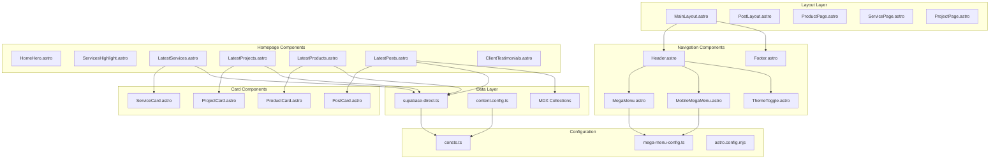
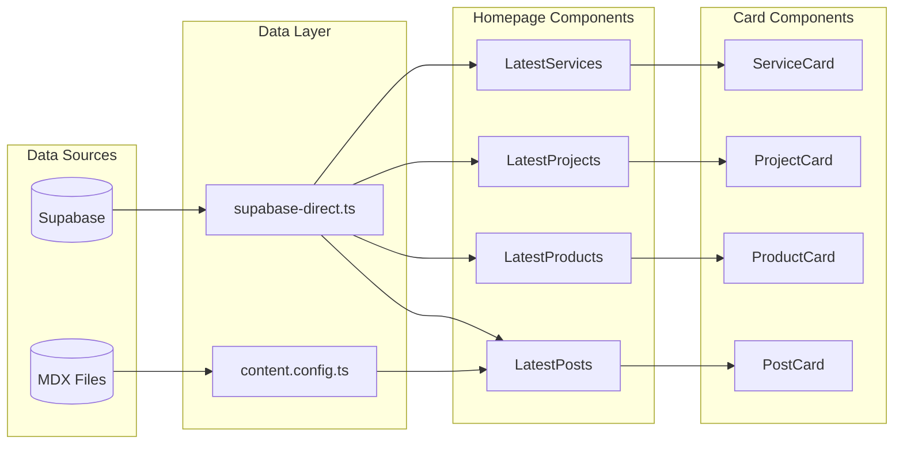
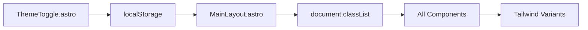

# DOKUMENTASI RELASI KOMPONEN - KOTACOM.ID

## 🔗 OVERVIEW RELASI KOMPONEN

Dokumentasi ini menjelaskan bagaimana komponen-komponen dalam project kotacom.id saling berinteraksi, alur data, dan dependency relationships.

---

## 📊 DIAGRAM ARSITEKTUR KOMPONEN



---

## 🏗️ HIERARCHY KOMPONEN

### 1. Layout Hierarchy

```
MainLayout.astro (Root Layout)
├── BaseHead.astro (SEO & Meta)
├── Header.astro (Navigation)
│   ├── MegaMenu.astro (Desktop Navigation)
│   │   └── mega-menu-config.ts (Config)
│   ├── MobileMegaMenu.astro (Mobile Navigation)
│   │   └── mega-menu-config.ts (Config)
│   └── ThemeToggle.astro (Dark Mode)
├── [SLOT: Page Content]
├── Footer.astro (Site Footer)
├── ContactButtons.astro (Floating CTAs)
└── SubscribeDrawer.astro (Newsletter Popup)
```

### 2. Specialized Layouts

```
PostLayout.astro (Blog Posts)
├── MainLayout.astro (Base)
├── SchemaMarkup.astro (SEO)
├── MinimalTOC.astro (Table of Contents)
├── RelatedList.astro (Related Posts)
└── InternalLinkSuggestions.astro (SEO Links)

ProductPage.astro (Product Details)
├── MainLayout.astro (Base)
├── ResponsiveImage.astro (Product Images)
├── SchemaMarkup.astro (Product Schema)
└── WhatsAppButton.astro (Purchase CTA)

ServicePage.astro (Service Details)
├── MainLayout.astro (Base)
├── ResponsiveImage.astro (Service Images)
├── SchemaMarkup.astro (Service Schema)
└── ContactButtons.astro (Contact CTAs)

ProjectPage.astro (Portfolio Details)
├── MainLayout.astro (Base)
├── ResponsiveImage.astro (Project Images)
├── SchemaMarkup.astro (Portfolio Schema)
└── WhatsAppButton.astro (Inquiry CTA)
```

---

## 🔄 DATA FLOW PATTERNS

### 1. Homepage Data Flow



### 2. Detail Page Data Flow

```mermaid
graph TB
    subgraph "Route Handler"
        PS[pages/[...slug].astro]
        PSV[pages/services/[slug].astro]
        PPR[pages/products/[slug].astro]
        PPJ[pages/projects/[slug].astro]
    end
    
    subgraph "Data Processing"
        SD[supabase-direct.ts]
        DF[Data Fetching]
        DN[Data Normalization]
    end
    
    subgraph "Layout Rendering"
        PL[PostLayout.astro]
        SPL[ServicePage.astro]
        PPL[ProductPage.astro]
        PRL[ProjectPage.astro]
    end
    
    PS --> DF
    PSV --> DF
    PPR --> DF
    PPJ --> DF
    
    DF --> SD
    SD --> DN
    
    DN --> PL
    DN --> SPL
    DN --> PPL
    DN --> PRL
```

---

## 🧩 KOMPONEN DEPENDENCIES

### 1. Core Dependencies

| Component | Dependencies | Purpose |
|-----------|-------------|---------|
| `MainLayout.astro` | `BaseHead`, `Header`, `Footer`, `ContactButtons`, `SubscribeDrawer` | Base page structure |
| `Header.astro` | `MegaMenu`, `MobileMegaMenu`, `ThemeToggle`, `mega-menu-config.ts` | Navigation |
| `BaseHead.astro` | `consts.ts`, SEO utilities | Meta tags & SEO |
| `SchemaMarkup.astro` | Structured data utilities | JSON-LD schema |

### 2. Homepage Dependencies

| Component | Data Source | Dependencies |
|-----------|-------------|-------------|
| `LatestServices.astro` | `getServicesDirectFromSupabase` | `ServiceCard.astro` |
| `LatestProjects.astro` | `getProjectsDirectFromSupabase` | `ProjectCard.astro` |
| `LatestProducts.astro` | `getProductsDirectFromSupabase` | `ProductCard.astro` |
| `LatestPosts.astro` | `getPostsDirectFromSupabase` + MDX | `PostCard.astro`, `BCategoryDropdown.astro` |

### 3. Card Component Dependencies

| Card Component | Data Input | UI Dependencies |
|----------------|------------|-----------------|
| `PostCard.astro` | Normalized post object | `ResponsiveImage`, `FormattedDate` |
| `ServiceCard.astro` | Service object with `sv` prefix | `ResponsiveImage`, WhatsApp integration |
| `ProductCard.astro` | Product object with `p` prefix | `ResponsiveImage`, Price formatting |
| `ProjectCard.astro` | Project object with `p` prefix | `ResponsiveImage`, Status badges |

---

## 🔧 COMPONENT INTERACTION PATTERNS

### 1. Parent-Child Data Passing

#### Pattern: Homepage → Latest Component → Card Component

```astro
<!-- index.astro (Parent) -->
---
// No data fetching here, delegated to child components
---
<MainLayout>
  <LatestServices limit={6} />
</MainLayout>

<!-- LatestServices.astro (Child) -->
---
interface Props {
  limit: number;
}
const { limit } = Astro.props;

// Data fetching happens here
const services = await getServicesDirectFromSupabase(limit);
const normalizedServices = services.map(normalize);
---
<section>
  {normalizedServices.map((service) => (
    <ServiceCard service={service} />
  ))}
</section>

<!-- ServiceCard.astro (Grandchild) -->
---
interface Props {
  service: any;
}
const { service } = Astro.props;
---
<article>
  <!-- Render service data -->
</article>
```

### 2. Configuration-driven Components

#### Pattern: Navigation Components

```typescript
// mega-menu-config.ts (Configuration)
export const MEGA_MENU_CONFIG = {
  layanan: {
    trigger: 'Layanan',
    sections: [
      {
        title: 'Pengembangan Digital',
        items: [...]
      }
    ]
  }
};

// MegaMenu.astro (Consumer)
---
import { MEGA_MENU_CONFIG } from '../data/mega-menu-config.ts';

// Component uses configuration to render menu
---
{Object.entries(MEGA_MENU_CONFIG).map(([key, config]) => (
  <div class="mega-menu-section">
    <!-- Render based on config -->
  </div>
))}
```

### 3. Cross-component Communication

#### Pattern: Theme Toggle

```astro
<!-- ThemeToggle.astro -->
<script>
  // Updates global theme state
  localStorage.setItem('theme', newTheme);
  document.documentElement.classList.toggle('dark');
</script>

<!-- MainLayout.astro -->
<script is:inline>
  // Reads theme state on page load
  var stored = localStorage.getItem('theme');
  if (theme === 'dark') {
    root.classList.add('dark');
  }
</script>
```

---

## 📦 COMPONENT CATEGORIES

### 1. Layout Components
| Component | Purpose | Key Features |
|-----------|---------|--------------|
| `MainLayout.astro` | Base page structure | SEO, navigation, footer, analytics |
| `PostLayout.astro` | Blog post layout | TOC, related posts, schema markup |
| `ProductPage.astro` | Product detail layout | Product schema, purchase CTAs |
| `ServicePage.astro` | Service detail layout | Service features, contact CTAs |
| `ProjectPage.astro` | Portfolio layout | Case study format, project details |

### 2. Navigation Components
| Component | Purpose | Key Features |
|-----------|---------|--------------|
| `Header.astro` | Main navigation | Logo, mega menu, search, theme toggle |
| `MegaMenu.astro` | Desktop dropdown menu | Multi-level navigation, icons |
| `MobileMegaMenu.astro` | Mobile navigation | Collapsible menu, touch-friendly |
| `Footer.astro` | Site footer | Links, contact info, social media |

### 3. Content Components
| Component | Purpose | Data Source |
|-----------|---------|-------------|
| `PostCard.astro` | Blog post preview | MDX + Supabase posts |
| `ServiceCard.astro` | Service preview | Supabase services |
| `ProductCard.astro` | Product preview | Supabase products |
| `ProjectCard.astro` | Portfolio preview | Supabase projects |

### 4. Utility Components
| Component | Purpose | Usage |
|-----------|---------|-------|
| `ResponsiveImage.astro` | Optimized images | All image displays |
| `LazyComponent.astro` | Lazy loading | Non-critical content |
| `FormattedDate.astro` | Date formatting | Timestamps |
| `SchemaMarkup.astro` | SEO structured data | All content pages |

### 5. Interactive Components
| Component | Purpose | Features |
|-----------|---------|----------|
| `ThemeToggle.astro` | Dark mode switcher | Local storage persistence |
| `WhatsAppButton.astro` | Contact CTA | Click tracking, custom messages |
| `ContactButtons.astro` | Floating action buttons | Multiple contact methods |
| `SubscribeDrawer.astro` | Newsletter signup | Modal with form |

---

## 🎯 COMPONENT USAGE PATTERNS

### 1. Homepage Component Pattern

```astro
<!-- Standard pattern untuk semua LatestXXX components -->
---
import { getXXXDirectFromSupabase } from "../../lib/supabase-direct";
import XXXCard from "../XXXCard.astro";

interface Props {
  limit: number;
}

const { limit } = Astro.props;

// 1. Data fetching
const data = await getXXXDirectFromSupabase(limit);

// 2. Data normalization (if needed)
const normalizedData = data.map(normalize);
---

<!-- 3. Section structure -->
<section class="bg-white dark:bg-gray-900">
  <div class="py-8 px-4 mx-auto max-w-screen-xl">
    <!-- 4. Section header -->
    <div class="max-w-screen-md mb-8">
      <h2>Section Title</h2>
      <p>Section Description</p>
    </div>
    
    <!-- 5. Responsive grid -->
    <div class="grid grid-cols-1 md:grid-cols-2 lg:grid-cols-3 gap-6">
      {normalizedData.map((item) => (
        <XXXCard item={item} />
      ))}
    </div>
    
    <!-- 6. CTA (optional) -->
    <div class="text-center mt-8">
      <a href="/xxx">Lihat Semua</a>
    </div>
  </div>
</section>
```

### 2. Card Component Pattern

```astro
<!-- Standard pattern untuk semua Card components -->
---
interface Props {
  entity: any;
  className?: string;
}

const { entity, className = '' } = Astro.props;

// 1. Data normalization
const normalized = {
  title: entity.title || entity.xxTitle || '',
  slug: entity.slug || entity.xxSlug || '',
  description: entity.description || entity.xxDescription || '',
  imageUrl: entity.imageUrl || entity.xxImageUrl || '',
  published: entity.published || entity.xxPublished || '',
};
---

<!-- 2. Card structure -->
<article class={`card-base-classes ${className}`}>
  <!-- 3. Image (conditional) -->
  {normalized.imageUrl && (
    <div class="aspect-video overflow-hidden rounded-t-lg">
      
    </div>
  )}
  
  <!-- 4. Content -->
  <div class="p-6">
    <!-- Title with link -->
    <h3>
      <a href={`/entity/${normalized.slug}`}>
        {normalized.title}
      </a>
    </h3>
    
    <!-- Description -->
    {normalized.description && (
      <p class="line-clamp-3">{normalized.description}</p>
    )}
    
    <!-- Metadata -->
    <div class="flex justify-between">
      <time>{formatDate(normalized.published)}</time>
      <a href={`/entity/${normalized.slug}`}>Selengkapnya →</a>
    </div>
  </div>
</article>
```

### 3. Detail Page Pattern

```astro
<!-- Pattern untuk semua detail pages -->
---
// 1. Data fetching (from params)
const { slug } = Astro.params;
const entity = await getEntityBySlug(slug);

// 2. SEO data preparation
const seoData = {
  title: entity.title,
  description: entity.description,
  image: entity.imageUrl,
  type: 'article', // or 'product', 'service'
};

// 3. Breadcrumbs
const breadcrumbs = [
  { name: 'Home', url: '/' },
  { name: 'Category', url: '/category' },
  { name: entity.title, url: `/entity/${slug}` }
];
---

<!-- 4. Layout with SEO -->
<EntityLayout {...seoData}>
  <!-- 5. Schema markup -->
  <SchemaMarkup type="entity" data={entity} breadcrumbs={breadcrumbs} />
  
  <!-- 6. Content rendering -->
  <article>
    <header>
      <h1>{entity.title}</h1>
      <time>{entity.published}</time>
    </header>
    
    <div class="prose">
      <Fragment set:html={entity.body} />
    </div>
    
    <!-- 7. CTAs -->
    <div class="cta-section">
      <WhatsAppButton message={`Inquiry tentang ${entity.title}`} />
    </div>
  </article>
</EntityLayout>
```

---

## 🔀 COMPONENT INTERACTION MATRIX

### Data Provider → Consumer Relationships

| Provider Component | Data Type | Consumer Components | Interaction Type |
|-------------------|-----------|-------------------|------------------|
| `supabase-direct.ts` | Posts | `LatestPosts.astro` → `PostCard.astro` | Data fetching |
| `supabase-direct.ts` | Services | `LatestServices.astro` → `ServiceCard.astro` | Data fetching |
| `supabase-direct.ts` | Products | `LatestProducts.astro` → `ProductCard.astro` | Data fetching |
| `supabase-direct.ts` | Projects | `LatestProjects.astro` → `ProjectCard.astro` | Data fetching |
| `mega-menu-config.ts` | Navigation | `MegaMenu.astro`, `MobileMegaMenu.astro` | Configuration |
| `consts.ts` | Site config | `BaseHead.astro`, `Footer.astro` | Global constants |
| `content.config.ts` | MDX schema | All MDX collections | Schema validation |

### UI Component → UI Component Relationships

| Parent Component | Child Components | Relationship Type |
|------------------|------------------|------------------|
| `Header.astro` | `MegaMenu`, `MobileMegaMenu`, `ThemeToggle` | Composition |
| `MainLayout.astro` | `Header`, `Footer`, `ContactButtons` | Layout composition |
| All Latest Components | Respective Card components | Data presentation |
| Detail Layouts | `ResponsiveImage`, `SchemaMarkup`, CTA buttons | Content enhancement |

---

## 🎨 STYLING & THEME RELATIONSHIPS

### 1. Theme System Flow



**Theme Classes Pattern**:
```css
/* All components use Tailwind dark mode variants */
.component {
  @apply bg-white dark:bg-gray-800;
  @apply text-gray-900 dark:text-white;
  @apply border-gray-200 dark:border-gray-700;
}
```

### 2. Responsive Design Relationships

```astro
<!-- Mobile-first responsive pattern -->
<div class="
  grid grid-cols-1           <!-- Mobile: single column -->
  md:grid-cols-2             <!-- Tablet: two columns -->
  lg:grid-cols-3             <!-- Desktop: three columns -->
  gap-4 md:gap-6 lg:gap-8    <!-- Responsive gaps -->
">
```

---

## 🔍 COMPONENT SEARCH & DISCOVERY

### 1. Find Component by Feature

| Feature | Primary Component | Related Components |
|---------|------------------|-------------------|
| **Navigation** | `Header.astro` | `MegaMenu.astro`, `MobileMegaMenu.astro` |
| **Blog Display** | `PostCard.astro` | `LatestPosts.astro`, `PostLayout.astro` |
| **Service Display** | `ServiceCard.astro` | `LatestServices.astro`, `ServicePage.astro` |
| **Product Display** | `ProductCard.astro` | `LatestProducts.astro`, `ProductPage.astro` |
| **Portfolio Display** | `ProjectCard.astro` | `LatestProjects.astro`, `ProjectPage.astro` |
| **SEO** | `BaseHead.astro` | `SchemaMarkup.astro` |
| **Contact** | `ContactButtons.astro` | `WhatsAppButton.astro` |
| **Search** | `search.astro` | Pagefind integration |

### 2. Find Component by Location

| Directory | Component Type | Examples |
|-----------|----------------|----------|
| `src/components/` | General components | `Header.astro`, `Footer.astro`, `PostCard.astro` |
| `src/components/Homepage/` | Homepage sections | `LatestPosts.astro`, `ServicesHighlight.astro` |
| `src/components/Popups/` | Modal components | `SubscribeDrawer.astro` |
| `src/layouts/` | Page layouts | `MainLayout.astro`, `PostLayout.astro` |

---

## 🔄 STATE MANAGEMENT

### 1. Client-side State

| State | Storage | Components Affected |
|-------|---------|-------------------|
| **Theme** | `localStorage.theme` | All components (via CSS classes) |
| **WhatsApp Clicks** | `localStorage.whatsapp_clicks` | Analytics tracking |
| **Search State** | Pagefind internal | `search.astro` |

### 2. Build-time State

| State | Source | Components Affected |
|-------|--------|-------------------|
| **Posts Data** | Supabase + MDX | `LatestPosts`, `PostCard`, `PostLayout` |
| **Services Data** | Supabase | `LatestServices`, `ServiceCard`, `ServicePage` |
| **Products Data** | Supabase | `LatestProducts`, `ProductCard`, `ProductPage` |
| **Projects Data** | Supabase | `LatestProjects`, `ProjectCard`, `ProjectPage` |
| **Navigation Config** | `mega-menu-config.ts` | `MegaMenu`, `MobileMegaMenu` |

---

## 🧪 COMPONENT TESTING PATTERNS

### 1. Component Isolation Testing

```astro
<!-- Test individual components -->
---
// Mock data for testing
const mockData = {
  title: 'Test Title',
  slug: 'test-slug',
  description: 'Test description',
  // ... other required fields
};
---

<ComponentToTest data={mockData} />
```

### 2. Integration Testing

```astro
<!-- Test component with real data -->
---
import { getTestData } from '../lib/test-utils';
const realData = await getTestData();
---

<ComponentToTest data={realData} />
```

### 3. Responsive Testing

```html
<!-- Test responsive behavior -->
<div class="test-container">
  <!-- Mobile viewport -->
  <div class="w-full max-w-sm">
    <Component />
  </div>
  
  <!-- Tablet viewport -->
  <div class="w-full max-w-2xl">
    <Component />
  </div>
  
  <!-- Desktop viewport -->
  <div class="w-full max-w-6xl">
    <Component />
  </div>
</div>
```

---

## 🔧 COMPONENT MODIFICATION GUIDELINES

### 1. Modifying Existing Components

#### Before Making Changes:
1. **Understand current usage**:
   ```bash
   # Search for component usage
   grep -r "ComponentName" src/
   ```

2. **Check data dependencies**:
   - What data does it expect?
   - What format is the data in?
   - Are there multiple data sources?

3. **Test current functionality**:
   - Run `npm run dev`
   - Verify component works as expected

#### Making Changes:
1. **Preserve existing interfaces**:
   ```typescript
   // ✅ GOOD: Extend existing interface
   interface Props {
     existingProp: string;
     newProp?: string;  // Optional to maintain compatibility
   }
   
   // ❌ BAD: Break existing interface
   interface Props {
     newProp: string;  // Missing existing props
   }
   ```

2. **Maintain backward compatibility**:
   ```astro
   ---
   const { existingProp, newProp = 'default' } = Astro.props;
   ---
   ```

3. **Update all usage locations**:
   - Find all files that import the component
   - Update props if needed
   - Test each usage location

### 2. Creating New Components

#### Component Naming Convention:
- **PascalCase** untuk file names: `NewComponent.astro`
- **Descriptive names**: `LatestBlogPosts.astro` bukan `Posts.astro`
- **Entity prefixes**: `PostCard`, `ServiceCard`, `ProductCard`

#### Component Structure:
```astro
---
// 1. Imports (external first, then internal)
import { Image } from "astro:assets";
import ExternalComponent from "./ExternalComponent.astro";

// 2. Interface definition
interface Props {
  required: string;
  optional?: boolean;
}

// 3. Props destructuring with defaults
const { required, optional = false } = Astro.props;

// 4. Data processing (if needed)
const processedData = processData(required);

// 5. Conditional logic
const shouldShow = optional && processedData.length > 0;
---

<!-- 6. Template with conditional rendering -->
{shouldShow && (
  <div class="component-wrapper">
    <!-- Component content -->
  </div>
)}

<!-- 7. Component-specific styles (if needed) -->
<style>
  .component-wrapper {
    /* Scoped styles */
  }
</style>

<!-- 8. Component-specific scripts (if needed) -->
<script>
  // Client-side functionality
</script>
```

---

## 🔗 COMPONENT COMMUNICATION PATTERNS

### 1. Props Drilling Pattern

```astro
<!-- Level 1: Page -->
---
const pageData = await fetchPageData();
---
<Layout>
  <Section data={pageData} />
</Layout>

<!-- Level 2: Section -->
---
interface Props {
  data: any;
}
const { data } = Astro.props;
---
<div>
  {data.items.map((item) => (
    <Card item={item} />
  ))}
</div>

<!-- Level 3: Card -->
---
interface Props {
  item: any;
}
const { item } = Astro.props;
---
<article>
  <h3>{item.title}</h3>
</article>
```

### 2. Configuration-based Pattern

```typescript
// Configuration file
export const COMPONENT_CONFIG = {
  homepage: {
    sections: [
      { component: 'LatestServices', limit: 6 },
      { component: 'LatestProjects', limit: 6 },
      { component: 'LatestProducts', limit: 6 },
    ]
  }
};

// Usage in page
---
import { COMPONENT_CONFIG } from '../data/config';

// Dynamic component rendering based on config
---
{COMPONENT_CONFIG.homepage.sections.map((section) => (
  <!-- Render component based on config -->
))}
```

### 3. Event-based Pattern (Client-side)

```astro
<!-- Component A: Event Emitter -->
<button onclick="dispatchEvent(new CustomEvent('theme-changed', { detail: newTheme }))">
  Toggle Theme
</button>

<!-- Component B: Event Listener -->
<script>
  document.addEventListener('theme-changed', (event) => {
    // Handle theme change
    updateComponentTheme(event.detail);
  });
</script>
```

---

## 📈 PERFORMANCE IMPACT OF COMPONENTS

### 1. Heavy Components (Optimize Usage)

| Component | Performance Impact | Optimization Strategy |
|-----------|-------------------|----------------------|
| `ProductCard.astro` | High (complex layout) | Use lazy loading, limit quantity |
| `MegaMenu.astro` | Medium (large DOM) | Conditional rendering, CSS containment |
| `SchemaMarkup.astro` | Low (JSON only) | Cache generated schema |
| `ResponsiveImage.astro` | Variable (depends on image) | Use Astro Image optimization |

### 2. Component Loading Strategies

```astro
<!-- Critical components: Load immediately -->
<Header />
<HomeHero />

<!-- Above-the-fold content: Load with priority -->
<LatestServices limit={3} />

<!-- Below-the-fold content: Lazy load -->
<LazyComponent>
  <LatestProjects limit={6} />
  <LatestProducts limit={6} />
</LazyComponent>

<!-- Non-critical: Load last -->
<Footer />
<SubscribeDrawer />
```

---

## 🛠️ COMPONENT DEBUGGING GUIDE

### 1. Component Not Rendering

**Debug Steps**:
1. Check import path
2. Verify props interface
3. Check data structure
4. Look for TypeScript errors
5. Verify CSS classes

**Common Fixes**:
```astro
<!-- ✅ Correct import -->
import Component from "./Component.astro";

<!-- ❌ Wrong import -->
import Component from "./component.astro";  // Case sensitive

<!-- ✅ Proper props -->
<Component title="Test" data={validData} />

<!-- ❌ Missing required props -->
<Component data={validData} />  // Missing title
```

### 2. Styling Issues

**Debug Steps**:
1. Check Tailwind classes
2. Verify dark mode variants
3. Check responsive breakpoints
4. Inspect CSS specificity

**Common Fixes**:
```astro
<!-- ✅ Complete responsive classes -->
<div class="grid grid-cols-1 md:grid-cols-2 lg:grid-cols-3">

<!-- ❌ Incomplete responsive -->
<div class="grid grid-cols-3">  <!-- Breaks on mobile -->

<!-- ✅ Dark mode variants -->
<div class="bg-white dark:bg-gray-800">

<!-- ❌ No dark mode -->
<div class="bg-white">  <!-- White background in dark mode -->
```

### 3. Data Flow Issues

**Debug Steps**:
1. Check console logs for data fetching
2. Verify data structure matches interface
3. Check normalization logic
4. Verify Supabase connection

**Common Fixes**:
```typescript
// ✅ Proper data validation
if (!data || !Array.isArray(data)) {
  console.warn('Invalid data received');
  return [];
}

// ✅ Safe property access
const title = entity.title || entity.xxTitle || 'Untitled';

// ❌ Unsafe property access
const title = entity.title.toLowerCase();  // Could throw error
```

---

## 📋 COMPONENT CHECKLIST

### When Creating New Component:

- [ ] **File location**: Correct directory (`components/`, `layouts/`, `Homepage/`)
- [ ] **Naming**: PascalCase, descriptive name
- [ ] **Props interface**: TypeScript interface defined
- [ ] **Error handling**: Graceful handling of missing data
- [ ] **Responsive design**: Mobile-first approach
- [ ] **Dark mode**: Dark variants for all styles
- [ ] **Accessibility**: ARIA labels, semantic HTML
- [ ] **Performance**: Lazy loading if below fold
- [ ] **SEO**: Proper heading hierarchy, meta data
- [ ] **Testing**: Test with real and mock data

### When Modifying Existing Component:

- [ ] **Backward compatibility**: Don't break existing usage
- [ ] **Interface consistency**: Maintain existing prop structure
- [ ] **Style consistency**: Follow existing design patterns
- [ ] **Data format**: Maintain expected data structure
- [ ] **Error handling**: Preserve existing error handling
- [ ] **Performance**: Don't degrade existing performance
- [ ] **Testing**: Test all usage locations
- [ ] **Documentation**: Update component docs if needed

---

## 🚀 COMPONENT OPTIMIZATION STRATEGIES

### 1. Bundle Size Optimization

```astro
<!-- ✅ Import only what you need -->
import { specificFunction } from 'large-library';

<!-- ❌ Import entire library -->
import * as library from 'large-library';

<!-- ✅ Dynamic imports for heavy components -->
---
const HeavyComponent = lazy(() => import('./HeavyComponent.astro'));
---

<!-- ✅ Conditional loading -->
{shouldLoadHeavyComponent && <HeavyComponent />}
```

### 2. Runtime Performance

```astro
<!-- ✅ Efficient loops -->
{items.map((item) => (
  <Card key={item.id} item={item} />
))}

<!-- ✅ Conditional rendering -->
{items.length > 0 && (
  <div class="items-grid">
    {items.map((item) => <Card item={item} />)}
  </div>
)}

<!-- ✅ Memoization for expensive calculations -->
---
const expensiveResult = useMemo(() => 
  expensiveCalculation(data), [data]
);
---
```

### 3. Loading Performance

```astro
<!-- ✅ Image optimization -->
<Image 
  src={imageUrl} 
  alt={title}
  width={400} 
  height={300}
  loading="lazy"
  decoding="async"
/>

<!-- ✅ Resource hints -->
<link rel="preload" href="/critical-font.woff2" as="font" type="font/woff2" crossorigin>

<!-- ✅ Critical CSS inlining -->
<style is:inline>
  /* Critical above-the-fold styles */
</style>
```

---

**Dokumentasi ini memberikan pemahaman lengkap tentang bagaimana komponen-komponen dalam project saling berinteraksi dan bagaimana cara memodifikasi atau menambah komponen baru dengan benar.**

**Last Updated**: $(date)
**Version**: 1.0.0