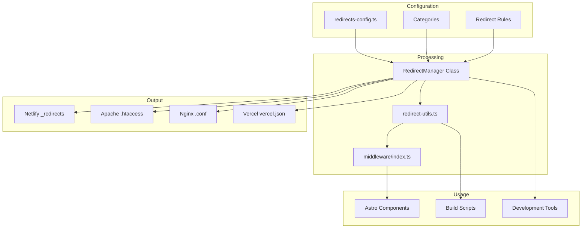

# 🔄 REDIRECT MANAGEMENT SYSTEM - KOTACOM.ID

## 📋 OVERVIEW

Sistem redirect management yang comprehensive untuk mengelola semua redirect di website kotacom.id. Mendukung multiple hosting platforms dan berbagai jenis redirect patterns.

---

## 🏗️ ARSITEKTUR SISTEM



---

## 📁 FILE STRUCTURE

```
src/
├── data/
│   └── redirects-config.ts        # Main configuration
├── lib/
│   └── redirect-utils.ts          # Utility functions
├── middleware/
│   └── index.ts                   # Astro middleware
└── components/
    └── RedirectTester.astro       # Development component

scripts/
└── generate-redirects.js          # Build script

Generated Files:
├── public/
│   ├── _redirects                 # Netlify
│   ├── .htaccess                  # Apache
│   └── nginx-redirects.conf       # Nginx
├── dist/
│   └── redirect-report.md         # Statistics
└── vercel.json                    # Vercel config
```

---

## 🔧 KONFIGURASI REDIRECT

### 1. Redirect Rule Interface

```typescript
interface RedirectRule {
  id: string;                      // Unique identifier
  from: string;                    // Source URL pattern
  to: string;                      // Destination URL
  status: 301 | 302 | 307 | 308;   // HTTP status code
  type: 'exact' | 'wildcard' | 'regex' | 'pattern';
  enabled: boolean;                // Enable/disable rule
  description?: string;            // Human-readable description
  category?: string;               // Rule category
  createdAt?: string;              // Creation timestamp
  updatedAt?: string;              // Last update timestamp
  conditions?: {                   // Optional conditions
    userAgent?: string[];
    referrer?: string[];
    query?: Record<string, string>;
    headers?: Record<string, string>;
  };
}
```

### 2. Redirect Types

#### Exact Match
```typescript
{
  id: 'home-alias',
  from: '/home',
  to: '/',
  status: 301,
  type: 'exact',
  enabled: true,
  description: 'Redirect /home to homepage'
}
```

#### Wildcard Pattern
```typescript
{
  id: 'legacy-blog',
  from: '/blog/*',
  to: '/:splat',
  status: 301,
  type: 'wildcard',
  enabled: true,
  description: 'Redirect old blog URLs to root level'
}
```

#### Parameter Pattern
```typescript
{
  id: 'posts-to-root',
  from: '/posts/:slug',
  to: '/:slug',
  status: 301,
  type: 'pattern',
  enabled: true,
  description: 'Redirect /posts/slug to root level'
}
```

#### Regex Pattern
```typescript
{
  id: 'uppercase-normalize',
  from: '/[A-Z]*',
  to: '/:splat',
  status: 301,
  type: 'regex',
  enabled: true,
  description: 'Redirect uppercase URLs to lowercase'
}
```

### 3. Categories

```typescript
export const REDIRECT_CATEGORIES = [
  {
    id: 'legacy-urls',
    name: 'Legacy URLs',
    description: 'Redirects from old URL structure',
    enabled: true
  },
  {
    id: 'seo-optimization',
    name: 'SEO Optimization', 
    description: 'SEO-focused redirects',
    enabled: true
  },
  {
    id: 'user-experience',
    name: 'User Experience',
    description: 'UX improvements and user-friendly redirects',
    enabled: true
  },
  {
    id: 'external',
    name: 'External Redirects',
    description: 'Redirects to external services',
    enabled: true
  },
  {
    id: 'maintenance',
    name: 'Maintenance',
    description: 'Temporary redirects for maintenance',
    enabled: true
  }
];
```

---

## 🛠️ IMPLEMENTASI & USAGE

### 1. Astro Middleware (Automatic)

```typescript
// src/middleware/index.ts
import { defineMiddleware } from 'astro:middleware';
import { checkRedirect } from '../lib/redirect-utils';

export const onRequest = defineMiddleware(async (context, next) => {
  const redirectResult = checkRedirect({
    pathname: context.url.pathname,
    userAgent: context.request.headers.get('user-agent') || undefined,
    referrer: context.request.headers.get('referer') || undefined
  });
  
  if (redirectResult.shouldRedirect && redirectResult.destination) {
    return new Response(null, {
      status: redirectResult.status || 301,
      headers: {
        Location: redirectResult.destination,
        'Cache-Control': redirectResult.status === 301 
          ? 'public, max-age=31536000' 
          : 'no-cache'
      }
    });
  }
  
  return next();
});
```

### 2. Manual Redirect in Components

```astro
---
// src/pages/example.astro
import { applyRedirect } from '../lib/redirect-utils';

// Check for redirects
const redirectResponse = applyRedirect(Astro);
if (redirectResponse) {
  return redirectResponse;
}
---

<MainLayout>
  <!-- Page content -->
</MainLayout>
```

### 3. Client-side Redirects

```astro
<!-- For client-side redirect checking -->
<script>
  import { clientRedirectUtils } from '../lib/redirect-utils';
  
  // Check and apply redirects on page load
  document.addEventListener('DOMContentLoaded', () => {
    clientRedirectUtils.applyClientRedirect();
  });
</script>
```

---

## 🎯 REDIRECT RULES YANG TERSEDIA

### Legacy URL Redirects
```
/blog/* → /:splat (301)
/posts/:slug → /:slug (301)
/layanan/* → /services/:splat (301)
```

### SEO Optimization
```
https://www.kotacom.id/* → https://kotacom.id/:splat (301)
/*/ → /:splat (301) [Remove trailing slashes]
/[A-Z]* → /:splat (301) [Lowercase normalization]
*.html → /:splat (301) [Remove file extensions]
*.php → /:splat (301) [Remove PHP extensions]
```

### User Experience
```
/home → / (301)
/about-us → /about (301)
/contact-us → /contact (301)
/portfolio → /projects (301)
/portfolio/* → /projects/:splat (301)
/service → /services (301)
/product → /products (301)
/project → /projects (301)
```

### External Service Redirects
```
/wa → WhatsApp contact link (302)
/wa/service → WhatsApp service inquiry (302)
/wa/website → WhatsApp website inquiry (302)
```

### Maintenance Redirects (Disabled by default)
```
/admin → /contact (302)
/dashboard → /contact (302)
```

---

## 🚀 BUILD INTEGRATION

### 1. Package.json Scripts

```json
{
  "scripts": {
    "build": "astro build",
    "build:redirects": "node scripts/generate-redirects.js",
    "build:full": "npm run build:redirects && npm run build",
    "dev:redirects": "node scripts/generate-redirects.js && npm run dev"
  }
}
```

### 2. Build Script Usage

```bash
# Generate redirect files only
npm run build:redirects

# Build with redirects
npm run build:full

# Development with redirects
npm run dev:redirects
```

### 3. Generated Files

#### Netlify (_redirects)
```
/blog/* /:splat 301
/posts/:slug /:slug 301
/home / 301
/about-us /about 301
/wa https://wa.me/6285799520350?text=... 302
```

#### Apache (.htaccess)
```apache
RewriteEngine On

# Redirect old blog URLs to root level
RewriteRule ^blog/(.*)$ /$1 [R=301,L]

# Redirect /posts/slug to root level
RewriteRule ^posts/([^/]+)$ /$1 [R=301,L]

# Redirect /home to homepage
RewriteRule ^home$ / [R=301,L]
```

#### Nginx (nginx-redirects.conf)
```nginx
# Redirect old blog URLs to root level
location ~ ^/blog/(.*)$ { return 301 /$1; }

# Redirect /posts/slug to root level  
location ~ ^/posts/([^/]+)$ { return 301 /$1; }

# Redirect /home to homepage
location = /home { return 301 /; }
```

#### Vercel (vercel.json)
```json
{
  "redirects": [
    {
      "source": "/blog/(.*)",
      "destination": "/$1",
      "permanent": true
    },
    {
      "source": "/posts/:slug",
      "destination": "/:slug", 
      "permanent": true
    }
  ]
}
```

---

## 🛠️ MANAGEMENT FUNCTIONS

### 1. RedirectManager Class

```typescript
import { RedirectManager } from '../data/redirects-config';

const manager = new RedirectManager();

// Get enabled rules
const enabledRules = manager.getEnabledRules();

// Find redirect for path
const redirect = manager.findRedirect('/blog/sample-post');

// Add new rule
const newRule = manager.addRule({
  from: '/old-path',
  to: '/new-path',
  status: 301,
  type: 'exact',
  enabled: true,
  category: 'user-experience',
  description: 'Redirect old path to new path'
});

// Update existing rule
manager.updateRule('rule-id', {
  enabled: false,
  description: 'Updated description'
});

// Remove rule
manager.removeRule('rule-id');

// Toggle rule
manager.toggleRule('rule-id', false);

// Get statistics
const stats = manager.getStats();
```

### 2. Utility Functions

```typescript
import { 
  checkRedirect, 
  handleAstroRedirect, 
  applyRedirect,
  urlUtils,
  devUtils 
} from '../lib/redirect-utils';

// Check redirect for path
const result = checkRedirect({ pathname: '/blog/test' });

// Handle in Astro component
const astroResult = handleAstroRedirect(Astro);

// Apply redirect
const response = applyRedirect(Astro);

// URL utilities
const normalized = urlUtils.normalize('/Path//With///Slashes/');
const isExternal = urlUtils.isExternal('https://google.com');
const absolute = urlUtils.makeAbsolute('/relative/path');

// Development utilities
const testResults = devUtils.testAllRules();
const perfStats = devUtils.getPerformanceStats();
const validation = devUtils.validateAllRules();
```

---

## 🧪 TESTING & DEVELOPMENT

### 1. Test All Rules

```typescript
import { devUtils } from '../lib/redirect-utils';

// Test common paths
const testResults = devUtils.testAllRules([
  '/blog/sample-post',
  '/posts/sample-post', 
  '/home',
  '/about-us',
  '/portfolio/project-1',
  '/wa',
  '/service'
]);

console.log('Test Results:', testResults);
```

### 2. Development Component

```astro
<!-- src/components/RedirectTester.astro -->
---
import { devUtils, redirectManager } from '../lib/redirect-utils';

// Only show in development
const isDev = import.meta.env.DEV;
const testResults = isDev ? devUtils.testAllRules() : [];
const stats = isDev ? redirectManager.getStats() : null;
---

{isDev && (
  <div class="fixed bottom-4 right-4 bg-white dark:bg-gray-800 border border-gray-200 dark:border-gray-700 rounded-lg p-4 shadow-lg max-w-md">
    <h3 class="text-sm font-bold mb-2">Redirect Stats</h3>
    <p class="text-xs text-gray-600 dark:text-gray-400">
      {stats?.enabled}/{stats?.total} rules enabled
    </p>
    
    <details class="mt-2">
      <summary class="text-xs font-medium cursor-pointer">Test Results</summary>
      <div class="mt-2 text-xs">
        {testResults.map(({ path, result }) => (
          <div class="flex justify-between">
            <span>{path}</span>
            <span class={result.shouldRedirect ? 'text-green-600' : 'text-gray-400'}>
              {result.shouldRedirect ? `→ ${result.destination}` : 'No redirect'}
            </span>
          </div>
        ))}
      </div>
    </details>
  </div>
)}
```

### 3. Validation Testing

```bash
# Test redirect configuration
node -e "
const { devUtils } = require('./src/lib/redirect-utils.js');
const validation = devUtils.validateAllRules();
const invalid = validation.filter(v => !v.validation.valid);
if (invalid.length > 0) {
  console.log('❌ Invalid rules found:');
  invalid.forEach(v => console.log(v.rule.id, v.validation.errors));
} else {
  console.log('✅ All rules valid');
}
"
```

---

## 📊 MONITORING & ANALYTICS

### 1. Redirect Tracking

```typescript
// Automatic tracking in redirect-utils.ts
export function trackRedirect(rule: RedirectRule, from: string, to: string) {
  // Google Analytics
  if (typeof gtag !== 'undefined') {
    gtag('event', 'redirect', {
      event_category: 'navigation',
      event_label: rule.id,
      custom_parameter_1: from,
      custom_parameter_2: to,
      custom_parameter_3: rule.status.toString()
    });
  }
  
  // Local storage for development
  const redirectHistory = JSON.parse(localStorage.getItem('redirect_history') || '[]');
  redirectHistory.push({
    rule: rule.id,
    from,
    to,
    status: rule.status,
    timestamp: new Date().toISOString()
  });
  localStorage.setItem('redirect_history', JSON.stringify(redirectHistory));
}
```

### 2. Performance Monitoring

```typescript
// Get performance statistics
const perfStats = devUtils.getPerformanceStats();

console.log('Redirect Performance:', {
  totalRules: perfStats.total,
  enabledRules: perfStats.enabled,
  averageComplexity: perfStats.averageRuleComplexity,
  hasConditionalRules: perfStats.hasConditionalRules,
  externalRedirects: perfStats.externalRedirects
});
```

---

## 🎯 COMMON USE CASES

### 1. Menambah Redirect Baru

```typescript
// Add to redirects-config.ts
{
  id: 'new-redirect',
  from: '/old-page',
  to: '/new-page',
  status: 301,
  type: 'exact',
  enabled: true,
  category: 'user-experience',
  description: 'Redirect old page to new page',
  createdAt: '2025-01-22'
}
```

### 2. Redirect dengan Conditions

```typescript
{
  id: 'mobile-redirect',
  from: '/desktop-only',
  to: '/mobile-friendly',
  status: 302,
  type: 'exact',
  enabled: true,
  category: 'user-experience',
  description: 'Redirect mobile users to mobile-friendly page',
  conditions: {
    userAgent: ['Mobile', 'Android', 'iPhone']
  }
}
```

### 3. External Service Redirects

```typescript
{
  id: 'whatsapp-contact',
  from: '/wa',
  to: 'https://wa.me/6285799520350?text=Halo%20kotacom.id',
  status: 302,
  type: 'exact',
  enabled: true,
  category: 'external',
  description: 'Quick WhatsApp contact'
}
```

### 4. Maintenance Redirects

```typescript
{
  id: 'maintenance-admin',
  from: '/admin',
  to: '/contact',
  status: 302,
  type: 'exact',
  enabled: false, // Enable during maintenance
  category: 'maintenance',
  description: 'Redirect admin during maintenance'
}
```

---

## 🔧 HOSTING PLATFORM SETUP

### 1. Netlify Setup

```bash
# Generate _redirects file
npm run build:redirects

# File generated at: public/_redirects
# Netlify automatically reads this file
```

**Netlify Configuration:**
```toml
# netlify.toml
[build]
  command = "npm run build:full"
  publish = "dist"

[[redirects]]
  from = "/*"
  to = "/404.html"
  status = 404
```

### 2. Vercel Setup

```bash
# Generate vercel.json
npm run build:redirects

# File updated: vercel.json
# Vercel automatically applies redirects
```

**Vercel Configuration:**
```json
{
  "buildCommand": "npm run build:full",
  "outputDirectory": "dist",
  "redirects": [
    // Auto-generated from redirect config
  ]
}
```

### 3. Apache Setup

```bash
# Generate .htaccess
npm run build:redirects

# Copy to web root:
cp public/.htaccess /var/www/html/.htaccess
```

### 4. Nginx Setup

```bash
# Generate nginx config
npm run build:redirects

# Include in nginx.conf:
include /path/to/nginx-redirects.conf;
```

---

## 📈 BEST PRACTICES

### 1. Redirect Status Codes

| Status | Use Case | Cache Behavior |
|--------|----------|----------------|
| **301** | Permanent redirect, SEO transfer | Cache for long time |
| **302** | Temporary redirect, no SEO impact | Don't cache |
| **307** | Temporary, preserve HTTP method | Don't cache |
| **308** | Permanent, preserve HTTP method | Cache for long time |

### 2. Performance Guidelines

```typescript
// ✅ GOOD: Simple patterns first
const rules = [
  { type: 'exact', from: '/home', to: '/' },
  { type: 'wildcard', from: '/blog/*', to: '/:splat' },
  { type: 'pattern', from: '/posts/:slug', to: '/:slug' },
  { type: 'regex', from: '/[A-Z]*', to: '/:splat' } // Most complex last
];

// ❌ BAD: Complex regex first
const rules = [
  { type: 'regex', from: '/complex-pattern.*', to: '/destination' }, // Slow
  { type: 'exact', from: '/simple', to: '/target' } // Fast but never reached
];
```

### 3. URL Pattern Guidelines

```typescript
// ✅ GOOD: Specific patterns
from: '/posts/:slug'        // Matches /posts/anything
from: '/category/:name'     // Matches /category/anything

// ✅ GOOD: Wildcard for catch-all
from: '/old-section/*'      // Matches /old-section/anything/deeper

// ⚠️ CAREFUL: Broad patterns
from: '/*'                  // Matches everything (use with conditions)

// ❌ BAD: Conflicting patterns
from: '/posts/*'            // Conflicts with /posts/:slug
from: '/posts/:slug'        // Will never match if wildcard comes first
```

### 4. Category Organization

```typescript
// Organize rules by purpose
const categories = {
  'legacy-urls': {        // Old URL structures
    priority: 1,          // High priority
    permanent: true       // Use 301 status
  },
  'seo-optimization': {   // SEO improvements
    priority: 2,
    permanent: true
  },
  'user-experience': {    // UX improvements
    priority: 3,
    permanent: true
  },
  'external': {          // External services
    priority: 4,
    permanent: false      // Use 302 status
  },
  'maintenance': {       // Temporary redirects
    priority: 5,
    permanent: false,
    enabled: false        // Disabled by default
  }
};
```

---

## 🔍 DEBUGGING & TROUBLESHOOTING

### 1. Debug Redirect Matching

```typescript
// Test specific path
import { redirectManager } from '../data/redirects-config';

const testPath = '/blog/sample-post';
const rule = redirectManager.findRedirect(testPath);

if (rule) {
  console.log('Match found:', rule);
  const destination = redirectManager.processDestination(testPath, rule);
  console.log('Destination:', destination);
} else {
  console.log('No redirect found for:', testPath);
}
```

### 2. Validate Rules

```typescript
// Check all rules for errors
import { devUtils } from '../lib/redirect-utils';

const validation = devUtils.validateAllRules();
const invalidRules = validation.filter(v => !v.validation.valid);

if (invalidRules.length > 0) {
  console.log('❌ Invalid rules:');
  invalidRules.forEach(({ rule, validation }) => {
    console.log(`${rule.id}: ${validation.errors.join(', ')}`);
  });
}
```

### 3. Performance Analysis

```typescript
// Analyze redirect performance
const perfStats = devUtils.getPerformanceStats();

console.log('Performance Analysis:', {
  totalRules: perfStats.total,
  enabledRules: perfStats.enabled,
  averageComplexity: perfStats.averageRuleComplexity,
  recommendations: perfStats.averageRuleComplexity > 2 
    ? 'Consider simplifying complex regex rules'
    : 'Performance looks good'
});
```

---

## 🚨 COMMON ISSUES & SOLUTIONS

### 1. Redirect Loops

```typescript
// ❌ BAD: Creates infinite loop
{
  from: '/a',
  to: '/b'
},
{
  from: '/b', 
  to: '/a'
}

// ✅ GOOD: Clear destination
{
  from: '/old-page',
  to: '/new-page'  // Final destination
}
```

### 2. Conflicting Rules

```typescript
// ❌ BAD: Order matters, first rule wins
{
  from: '/posts/*',     // Catches everything
  to: '/blog/:splat'
},
{
  from: '/posts/special', // Never reached
  to: '/special-page'
}

// ✅ GOOD: Specific rules first
{
  from: '/posts/special', // Specific rule first
  to: '/special-page'
},
{
  from: '/posts/*',       // General rule after
  to: '/blog/:splat'
}
```

### 3. Missing Parameters

```typescript
// ❌ BAD: Parameter not captured
{
  from: '/posts/:slug',
  to: '/blog/'          // Missing :slug parameter
}

// ✅ GOOD: Parameter preserved
{
  from: '/posts/:slug',
  to: '/blog/:slug'     // Parameter included
}
```

---

## 📋 MAINTENANCE CHECKLIST

### Regular Tasks
- [ ] **Review redirect logs**: Check for 404s that need redirects
- [ ] **Update external URLs**: Verify external service links
- [ ] **Performance check**: Monitor redirect response times
- [ ] **Rule cleanup**: Remove outdated redirect rules
- [ ] **Testing**: Test critical redirect paths

### Monthly Tasks
- [ ] **Analytics review**: Check redirect usage statistics
- [ ] **SEO audit**: Verify redirect impact on search rankings
- [ ] **User feedback**: Check for reported broken links
- [ ] **Documentation**: Update redirect documentation

### Before Deployment
- [ ] **Generate files**: Run `npm run build:redirects`
- [ ] **Validate rules**: Check for errors dengan `devUtils.validateAllRules()`
- [ ] **Test critical paths**: Verify important redirects work
- [ ] **Performance check**: Ensure no redirect loops

---

## 🎯 QUICK REFERENCE

### Add New Redirect
```typescript
// 1. Add to REDIRECT_RULES in src/data/redirects-config.ts
{
  id: 'unique-id',
  from: '/source-path',
  to: '/destination-path',
  status: 301,
  type: 'exact',
  enabled: true,
  category: 'user-experience',
  description: 'Description of redirect'
}

// 2. Generate redirect files
npm run build:redirects

// 3. Test the redirect
// Visit /source-path and verify redirect to /destination-path
```

### Disable Redirect
```typescript
// Set enabled: false in config
{
  id: 'rule-to-disable',
  // ... other properties
  enabled: false
}
```

### External Redirect
```typescript
// Use full URL in 'to' field
{
  id: 'external-service',
  from: '/external',
  to: 'https://external-service.com/path',
  status: 302, // Temporary for external
  type: 'exact',
  enabled: true,
  category: 'external'
}
```

---

**Sistem redirect management ini memberikan kontrol penuh atas semua redirect di website dengan dukungan multiple hosting platforms dan monitoring yang comprehensive.**

**Status**: ✅ IMPLEMENTED
**Next Steps**: Generate redirect files dan test pada hosting platform yang digunakan.