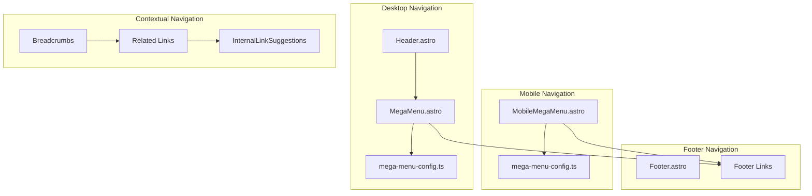
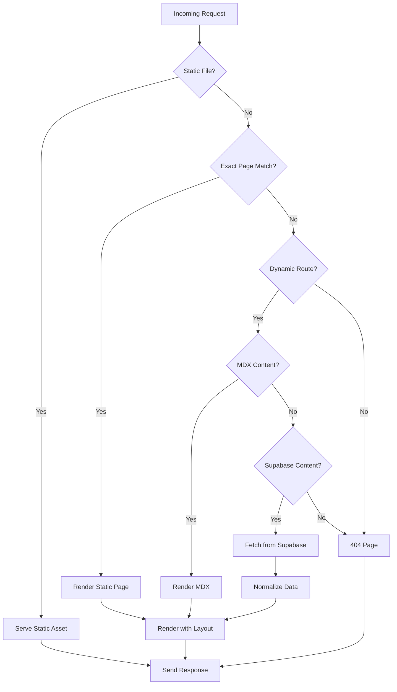

# PANDUAN ROUTING & NAVIGASI - KOTACOM.ID

## 🗺️ OVERVIEW SISTEM ROUTING

Dokumentasi ini menjelaskan sistem routing berbasis file Astro, struktur halaman, dan pola navigasi dalam project kotacom.id.

---

## 📁 STRUKTUR ROUTING FILE-BASED

### 1. Astro File-based Routing

```
src/pages/
├── index.astro                    # / (Homepage)
├── [...slug].astro               # /blog-post-slug (Dynamic blog posts)
├── [...page].astro               # /1, /2, /3 (Pagination)
├── contact.astro                 # /contact
├── search.astro                  # /search
├── privacy.astro                 # /privacy
├── 404.astro                     # 404 error page
├── rss.xml.js                    # /rss.xml (RSS feed)
│
├── about/
│   └── index.astro               # /about
│
├── posts/
│   ├── *.mdx                     # /posts/post-slug (MDX blog posts)
│   └── index.astro               # /posts (Posts listing)
│
├── services/
│   ├── index.astro               # /services (Services listing)
│   ├── *.mdx                     # /services/service-slug (MDX services)
│   └── [slug].astro              # /services/dynamic-slug (Dynamic services)
│
├── products/
│   ├── index.astro               # /products (Products listing)
│   ├── *.mdx                     # /products/product-slug (MDX products)
│   └── [slug].astro              # /products/dynamic-slug (Dynamic products)
│
├── projects/
│   ├── [...page].astro           # /projects, /projects/2, etc. (Paginated)
│   ├── *.mdx                     # /projects/project-slug (MDX projects)
│   └── [slug].astro              # /projects/dynamic-slug (Dynamic projects)
│
├── category/
│   └── [category].astro          # /category/tech, /category/design
│
└── layanan/
    └── *.astro                   # /layanan/* (Static service pages)
```

---

## 🔄 ROUTING PATTERNS & LOGIC

### 1. Dynamic Route Handlers

#### 1.1 Blog Posts: `[...slug].astro`
```astro
---
// Handles both MDX and Supabase posts
import { getCollection } from "astro:content";
import { getPostsDirectFromSupabase, convertSupabasePost } from "../lib/supabase-direct";

export async function getStaticPaths() {
  // 1. Get MDX posts
  const mdxPosts = await getCollection("postsMdx");
  
  // 2. Get Supabase posts
  const supabasePosts = await getPostsDirectFromSupabase(10000);
  
  // 3. Create paths for both sources
  const mdxPaths = mdxPosts.map((post) => ({
    params: { slug: post.data.slug },
    props: { post, source: 'mdx' }
  }));
  
  const supabasePaths = supabasePosts.map((post) => ({
    params: { slug: post.slug },
    props: { post: convertSupabasePost(post), source: 'supabase' }
  }));
  
  return [...mdxPaths, ...supabasePaths];
}

const { post, source } = Astro.props;
---

<PostLayout post={post} source={source} />
```

#### 1.2 Pagination: `[...page].astro`
```astro
---
export async function getStaticPaths({ paginate }) {
  const allProjects = await getProjectsDirectFromSupabase();
  
  return paginate(allProjects, {
    pageSize: 12,
    params: (page) => ({ page: page.toString() }),
    props: (page) => ({ 
      projects: page.data,
      currentPage: page.currentPage,
      totalPages: page.lastPage 
    })
  });
}

const { projects, currentPage, totalPages } = Astro.props;
---

<ProjectsPage 
  projects={projects} 
  currentPage={currentPage} 
  totalPages={totalPages} 
/>
```

#### 1.3 Category Filtering: `category/[category].astro`
```astro
---
export async function getStaticPaths() {
  // Get all unique categories from all entities
  const services = await getServicesDirectFromSupabase();
  const products = await getProductsDirectFromSupabase();
  
  const categories = [...new Set([
    ...services.flatMap(s => s.category || []),
    ...products.flatMap(p => p.category || [])
  ])];
  
  return categories.map(category => ({
    params: { category: category.toLowerCase() },
    props: { 
      category,
      services: services.filter(s => s.category?.includes(category)),
      products: products.filter(p => p.category?.includes(category))
    }
  }));
}

const { category, services, products } = Astro.props;
---

<CategoryPage category={category} services={services} products={products} />
```

---

## 🧭 NAVIGATION SYSTEM

### 1. Navigation Hierarchy



### 2. Mega Menu Configuration

#### 2.1 Desktop Mega Menu Structure
**File**: `src/data/mega-menu-config.ts`

```typescript
export const MEGA_MENU_CONFIG = {
  layanan: {
    trigger: 'Layanan',
    sections: [
      {
        title: 'Pengembangan Digital',
        icon: ICONS.code,
        items: [
          {
            title: 'Website Development',
            url: '/services/website-software-development',
            description: 'Pembuatan website profesional dan responsif',
            icon: ICONS.globe
          },
          // ... more items
        ]
      },
      // ... more sections
    ]
  },
  portfolio: {
    trigger: 'Portfolio',
    sections: [
      {
        title: 'Proyek Terbaru',
        items: [
          { title: 'Semua Portfolio', url: '/projects' },
          // ... more items
        ]
      }
    ]
  },
  produk: {
    trigger: 'Produk',
    sections: [
      // ... product sections
    ]
  }
};
```

#### 2.2 Simple Navigation Items
```typescript
export const SIMPLE_NAV_ITEMS = [
  { title: 'Artikel', url: '/posts' },
  { title: 'Tentang', url: '/about' },
  { title: 'Kontak', url: '/contact' }
];
```

#### 2.3 Mobile Menu Configuration
```typescript
export const MOBILE_MENU_CONFIG = {
  mainItems: [
    { title: 'Layanan', url: '/services', icon: ICONS.services },
    { title: 'Portfolio', url: '/projects', icon: ICONS.portfolio },
    { title: 'Produk', url: '/products', icon: ICONS.shopping }
  ],
  secondaryItems: SIMPLE_NAV_ITEMS,
  footer: {
    title: 'Butuh Bantuan?',
    cta: {
      text: 'Konsultasi Gratis',
      url: '/contact'
    }
  }
};
```

---

## 🎯 PAGE TYPES & PATTERNS

### 1. Static Pages

#### 1.1 Homepage (`index.astro`)
```astro
---
import MainLayout from "../layouts/MainLayout.astro";
import HomeHero from "../components/Homepage/HomeHero.astro";
// ... other homepage components

const reviews = [/* sample reviews for schema */];
const breadcrumbs = [{ name: "Home", url: "/" }];
---

<MainLayout title="Site Title" description="Site Description">
  <SchemaMarkup type="homepage" reviews={reviews} breadcrumbs={breadcrumbs} />
  
  <HomeHero />
  <ServicesHighlight />
  <main>
    <LatestServices limit={6} />
    <LatestProjects limit={6} />
    <LatestProducts limit={6} />
    <ClientTestimonials />
    <LatestPosts limit={6} />
  </main>
</MainLayout>
```

#### 1.2 Contact Page (`contact.astro`)
```astro
---
import MainLayout from "../layouts/MainLayout.astro";
import ContactButtons from "../components/ContactButtons.astro";

const contactData = {
  title: "Hubungi Kami",
  description: "Tim kotacom.id siap membantu kebutuhan IT Anda"
};
---

<MainLayout {...contactData}>
  <main class="contact-page">
    <!-- Contact form and information -->
    <ContactButtons />
  </main>
</MainLayout>
```

### 2. Dynamic Pages

#### 2.1 Entity Listing Pages

**Services Listing** (`services/index.astro`):
```astro
---
import { getServicesDirectFromSupabase } from "../../lib/supabase-direct";
import ServiceCard from "../../components/ServiceCard.astro";
import SCategoryDropdown from "../../components/SCategoryDropdown.astro";

// Fetch all services for listing
const services = await getServicesDirectFromSupabase(10000);

// Group by categories for filtering
const categories = [...new Set(services.flatMap(s => s.category || []))];
---

<MainLayout title="Layanan IT" description="Semua layanan IT profesional">
  <main class="services-listing">
    <div class="filters-section">
      <SCategoryDropdown categories={categories} />
    </div>
    
    <div class="services-grid">
      {services.map((service) => (
        <ServiceCard service={service} />
      ))}
    </div>
  </main>
</MainLayout>
```

**Products Listing** (`products/index.astro`):
```astro
---
import { getProductsDirectFromSupabase } from "../../lib/supabase-direct";
import ProductCard from "../../components/ProductCard.astro";
import PCountryDropdown from "../../components/PCountryDropdown.astro";
import PLocaleDropdown from "../../components/PLocaleDropdown.astro";

const products = await getProductsDirectFromSupabase(10000);

// Extract filter options
const countries = [...new Set(products.flatMap(p => p.country || []))];
const locales = [...new Set(products.flatMap(p => p.locale || []))];
---

<MainLayout title="Produk Digital" description="Produk digital dan software">
  <main class="products-listing">
    <div class="filters-section">
      <PCountryDropdown countries={countries} />
      <PLocaleDropdown locales={locales} />
    </div>
    
    <div class="products-grid">
      {products.map((product) => (
        <ProductCard product={product} />
      ))}
    </div>
  </main>
</MainLayout>
```

#### 2.2 Entity Detail Pages

**Dynamic Service Page** (`services/[slug].astro`):
```astro
---
import { getServicesDirectFromSupabase } from "../../lib/supabase-direct";
import ServicePage from "../../layouts/ServicePage.astro";

export async function getStaticPaths() {
  const services = await getServicesDirectFromSupabase(10000, 'all');
  
  return services.map((service) => ({
    params: { slug: service.slug },
    props: { service }
  }));
}

const { service } = Astro.props;

// Prepare SEO data
const seoData = {
  title: service.title,
  description: service.description,
  image: service.imageUrl1,
  type: 'service' as const,
  published: service.published
};

// Prepare breadcrumbs
const breadcrumbs = [
  { name: 'Home', url: '/' },
  { name: 'Layanan', url: '/services' },
  { name: service.title, url: `/services/${service.slug}` }
];
---

<ServicePage service={service} seoData={seoData} breadcrumbs={breadcrumbs} />
```

---

## 🔀 ROUTING DECISION TREE

### Route Resolution Logic



### Route Priority Order

1. **Static Files** (`public/` directory)
2. **Exact Page Matches** (`pages/contact.astro` → `/contact`)
3. **MDX Files** (`pages/posts/my-post.mdx` → `/posts/my-post`)
4. **Dynamic Routes** (`pages/[slug].astro`)
5. **Catch-all Routes** (`pages/[...slug].astro`)
6. **404 Fallback** (`pages/404.astro`)

---

## 📄 PAGE TEMPLATES & LAYOUTS

### 1. Layout Template Mapping

| Route Pattern | Layout Template | Purpose |
|---------------|----------------|---------|
| `/` | `MainLayout.astro` | Homepage |
| `/posts/*` | `PostLayout.astro` | Blog posts |
| `/services/*` | `ServicePage.astro` | Service details |
| `/products/*` | `ProductPage.astro` | Product details |
| `/projects/*` | `ProjectPage.astro` | Portfolio details |
| `/contact` | `MainLayout.astro` | Contact page |
| `/search` | `MainLayout.astro` | Search page |

### 2. Layout Props Interface

#### 2.1 MainLayout Props
```typescript
interface MainLayoutProps {
  title?: string;
  description?: string;
  image?: string;
  type?: 'website' | 'article' | 'product' | 'service' | 'project' | 'page';
  published?: string;
  modified?: string;
  section?: string;
  tags?: string[];
}
```

#### 2.2 Specialized Layout Props
```typescript
// PostLayout
interface PostLayoutProps extends MainLayoutProps {
  post: any;
  source: 'mdx' | 'supabase';
  relatedPosts?: any[];
}

// ProductPage
interface ProductPageProps extends MainLayoutProps {
  product: any;
  relatedProducts?: any[];
  breadcrumbs?: BreadcrumbItem[];
}

// ServicePage
interface ServicePageProps extends MainLayoutProps {
  service: any;
  relatedServices?: any[];
  breadcrumbs?: BreadcrumbItem[];
}

// ProjectPage
interface ProjectPageProps extends MainLayoutProps {
  project: any;
  relatedProjects?: any[];
  breadcrumbs?: BreadcrumbItem[];
}
```

---

## 🔍 CONTENT DISCOVERY & ROUTING

### 1. Multi-source Content Resolution

#### 1.1 Posts Resolution Priority
```typescript
// Order of content resolution for posts:
1. MDX files in pages/posts/
2. Supabase posts table
3. Fallback to 404

// Implementation in [...slug].astro:
export async function getStaticPaths() {
  // MDX posts (higher priority)
  const mdxPosts = await getCollection("postsMdx");
  
  // Supabase posts (lower priority, but checked for conflicts)
  const supabasePosts = await getPostsDirectFromSupabase(10000);
  
  // Merge with conflict resolution
  const allSlugs = new Set();
  const paths = [];
  
  // Add MDX first (higher priority)
  mdxPosts.forEach(post => {
    if (!allSlugs.has(post.data.slug)) {
      allSlugs.add(post.data.slug);
      paths.push({
        params: { slug: post.data.slug },
        props: { post, source: 'mdx' }
      });
    }
  });
  
  // Add Supabase posts if no conflict
  supabasePosts.forEach(post => {
    if (!allSlugs.has(post.slug)) {
      allSlugs.add(post.slug);
      paths.push({
        params: { slug: post.slug },
        props: { post: convertSupabasePost(post), source: 'supabase' }
      });
    }
  });
  
  return paths;
}
```

### 2. SEO-friendly URL Structure

#### 2.1 URL Patterns
```
Entity URLs:
├── /posts/                        # Posts listing
├── /posts/how-to-build-website    # Individual post
├── /services/                     # Services listing  
├── /services/website-development  # Individual service
├── /products/                     # Products listing
├── /products/pos-system-template  # Individual product
├── /projects/                     # Projects listing (page 1)
├── /projects/2                    # Projects page 2
└── /projects/restaurant-system    # Individual project

Category URLs:
├── /category/teknologi            # Posts by category
├── /category/website              # Projects by category
└── /category/software             # Products by category

Utility URLs:
├── /search                        # Search page
├── /contact                       # Contact page
├── /about                         # About page
├── /privacy                       # Privacy policy
└── /rss.xml                       # RSS feed
```

#### 2.2 Slug Generation Rules
```typescript
// Slug normalization rules:
1. Lowercase only
2. Replace spaces with hyphens
3. Remove special characters
4. Maximum 60 characters
5. Ensure uniqueness across entities

// Example implementation:
function generateSlug(title: string): string {
  return title
    .toLowerCase()
    .replace(/[^a-z0-9\s-]/g, '')
    .replace(/\s+/g, '-')
    .replace(/-+/g, '-')
    .trim()
    .slice(0, 60);
}
```

---

## 🔗 INTERNAL LINKING STRATEGY

### 1. Cross-entity Linking

#### 1.1 Related Content Logic
```typescript
// Related posts logic (in PostLayout)
const relatedPosts = allPosts.filter(post => 
  post.id !== currentPost.id &&
  post.tags.some(tag => currentPost.tags.includes(tag))
).slice(0, 3);

// Related services logic (in ServicePage)
const relatedServices = allServices.filter(service =>
  service.id !== currentService.id &&
  service.category.some(cat => currentService.category.includes(cat))
).slice(0, 3);
```

#### 1.2 Internal Link Suggestions
**Component**: `InternalLinkSuggestions.astro`

```astro
---
// Generate contextual internal links based on content
interface Props {
  currentPage: any;
  allContent: any[];
}

const { currentPage, allContent } = Astro.props;

// Find related content based on:
// 1. Same category/tags
// 2. Similar keywords in title/description
// 3. Recent content
const suggestions = generateInternalLinks(currentPage, allContent);
---

<div class="internal-links-section">
  <h3>Artikel Terkait</h3>
  {suggestions.map((link) => (
    <a href={link.url} class="internal-link">
      {link.title}
    </a>
  ))}
</div>
```

### 2. Breadcrumb Navigation

#### 2.1 Breadcrumb Generation
```typescript
// Dynamic breadcrumb generation based on route
function generateBreadcrumbs(pathname: string, entity?: any): BreadcrumbItem[] {
  const parts = pathname.split('/').filter(Boolean);
  const breadcrumbs: BreadcrumbItem[] = [
    { name: 'Home', url: '/' }
  ];
  
  if (parts.length === 0) return breadcrumbs;
  
  // Build breadcrumbs based on path segments
  let currentPath = '';
  parts.forEach((part, index) => {
    currentPath += `/${part}`;
    
    if (index === parts.length - 1 && entity) {
      // Last segment with entity data
      breadcrumbs.push({
        name: entity.title,
        url: currentPath
      });
    } else {
      // Intermediate segments
      breadcrumbs.push({
        name: capitalize(part),
        url: currentPath
      });
    }
  });
  
  return breadcrumbs;
}
```

#### 2.2 Breadcrumb Usage in Layouts
```astro
<!-- In specialized layouts -->
---
const breadcrumbs = generateBreadcrumbs(Astro.url.pathname, entity);
---

<nav aria-label="Breadcrumb">
  <ol class="flex items-center space-x-2">
    {breadcrumbs.map((crumb, index) => (
      <li class="flex items-center">
        {index > 0 && <span class="mx-2">/</span>}
        {index === breadcrumbs.length - 1 ? (
          <span class="current-page">{crumb.name}</span>
        ) : (
          <a href={crumb.url} class="breadcrumb-link">
            {crumb.name}
          </a>
        )}
      </li>
    ))}
  </ol>
</nav>
```

---

## 🔄 PAGINATION SYSTEM

### 1. Pagination Implementation

#### 1.1 Projects Pagination (`projects/[...page].astro`)
```astro
---
import { getProjectsDirectFromSupabase } from "../../lib/supabase-direct";

export async function getStaticPaths({ paginate }) {
  const allProjects = await getProjectsDirectFromSupabase(10000);
  
  // Sort by published date (newest first)
  const sortedProjects = allProjects.sort((a, b) => 
    new Date(b.published).getTime() - new Date(a.published).getTime()
  );
  
  return paginate(sortedProjects, {
    pageSize: 12,
    params: (page) => ({ 
      page: page.currentPage === 1 ? undefined : page.currentPage.toString() 
    }),
    props: (page) => ({
      projects: page.data,
      currentPage: page.currentPage,
      totalPages: page.lastPage,
      hasNext: page.currentPage < page.lastPage,
      hasPrev: page.currentPage > 1,
      nextUrl: page.currentPage < page.lastPage ? 
        `/projects/${page.currentPage + 1}` : null,
      prevUrl: page.currentPage > 1 ? 
        (page.currentPage === 2 ? '/projects' : `/projects/${page.currentPage - 1}`) : null
    })
  });
}

const { projects, currentPage, totalPages, hasNext, hasPrev, nextUrl, prevUrl } = Astro.props;
---

<MainLayout title={`Portfolio - Halaman ${currentPage}`}>
  <main class="projects-page">
    <!-- Projects grid -->
    <div class="projects-grid">
      {projects.map((project) => (
        <ProjectCard project={project} />
      ))}
    </div>
    
    <!-- Pagination controls -->
    <nav class="pagination" aria-label="Pagination Navigation">
      {hasPrev && (
        <a href={prevUrl} class="pagination-prev">
          ← Sebelumnya
        </a>
      )}
      
      <span class="pagination-info">
        Halaman {currentPage} dari {totalPages}
      </span>
      
      {hasNext && (
        <a href={nextUrl} class="pagination-next">
          Selanjutnya →
        </a>
      )}
    </nav>
  </main>
</MainLayout>
```

### 2. Pagination Component

#### 2.1 Reusable Pagination Component
```astro
<!-- src/components/Pagination.astro -->
---
interface Props {
  currentPage: number;
  totalPages: number;
  baseUrl: string;
  showFirstLast?: boolean;
}

const { currentPage, totalPages, baseUrl, showFirstLast = true } = Astro.props;

// Generate page numbers to show
const generatePageNumbers = (current: number, total: number) => {
  const pages = [];
  const showPages = 5; // Show 5 page numbers
  
  let start = Math.max(1, current - Math.floor(showPages / 2));
  let end = Math.min(total, start + showPages - 1);
  
  // Adjust start if we're near the end
  if (end - start + 1 < showPages) {
    start = Math.max(1, end - showPages + 1);
  }
  
  for (let i = start; i <= end; i++) {
    pages.push(i);
  }
  
  return pages;
};

const pageNumbers = generatePageNumbers(currentPage, totalPages);
const hasPrev = currentPage > 1;
const hasNext = currentPage < totalPages;
const prevUrl = currentPage === 2 ? baseUrl : `${baseUrl}/${currentPage - 1}`;
const nextUrl = `${baseUrl}/${currentPage + 1}`;
---

<nav class="pagination" aria-label="Pagination Navigation">
  <div class="flex items-center justify-center space-x-2">
    <!-- First page -->
    {showFirstLast && currentPage > 3 && (
      <>
        <a href={baseUrl} class="pagination-link">1</a>
        {currentPage > 4 && <span class="pagination-ellipsis">...</span>}
      </>
    )}
    
    <!-- Previous page -->
    {hasPrev && (
      <a href={prevUrl} class="pagination-link pagination-prev">
        ← Prev
      </a>
    )}
    
    <!-- Page numbers -->
    {pageNumbers.map((pageNum) => (
      pageNum === currentPage ? (
        <span class="pagination-current" aria-current="page">
          {pageNum}
        </span>
      ) : (
        <a 
          href={pageNum === 1 ? baseUrl : `${baseUrl}/${pageNum}`}
          class="pagination-link"
        >
          {pageNum}
        </a>
      )
    ))}
    
    <!-- Next page -->
    {hasNext && (
      <a href={nextUrl} class="pagination-link pagination-next">
        Next →
      </a>
    )}
    
    <!-- Last page -->
    {showFirstLast && currentPage < totalPages - 2 && (
      <>
        {currentPage < totalPages - 3 && <span class="pagination-ellipsis">...</span>}
        <a href={`${baseUrl}/${totalPages}`} class="pagination-link">
          {totalPages}
        </a>
      </>
    )}
  </div>
  
  <!-- Page info -->
  <div class="pagination-info text-center mt-4 text-sm text-gray-600 dark:text-gray-400">
    Halaman {currentPage} dari {totalPages}
  </div>
</nav>

<style>
  .pagination-link {
    @apply px-3 py-2 text-sm font-medium text-gray-500 bg-white border border-gray-300 rounded-md hover:bg-gray-50 hover:text-gray-700 dark:bg-gray-800 dark:border-gray-700 dark:text-gray-400 dark:hover:bg-gray-700 dark:hover:text-white;
  }
  
  .pagination-current {
    @apply px-3 py-2 text-sm font-medium text-blue-600 bg-blue-50 border border-blue-300 rounded-md dark:bg-blue-900 dark:border-blue-700 dark:text-blue-400;
  }
  
  .pagination-ellipsis {
    @apply px-3 py-2 text-sm font-medium text-gray-500;
  }
</style>
```

---

## 🎛️ FILTERING & SEARCH ROUTING

### 1. Category Filtering

#### 1.1 Category Route Handler (`category/[category].astro`)
```astro
---
import { getServicesDirectFromSupabase, getProductsDirectFromSupabase } from "../../lib/supabase-direct";

export async function getStaticPaths() {
  // Get all content to extract categories
  const [services, products] = await Promise.all([
    getServicesDirectFromSupabase(10000),
    getProductsDirectFromSupabase(10000)
  ]);
  
  // Extract unique categories
  const serviceCategories = services.flatMap(s => s.category || []);
  const productCategories = products.flatMap(p => p.category || []);
  const allCategories = [...new Set([...serviceCategories, ...productCategories])];
  
  return allCategories.map(category => {
    const categorySlug = category.toLowerCase().replace(/\s+/g, '-');
    
    return {
      params: { category: categorySlug },
      props: {
        category,
        categorySlug,
        services: services.filter(s => 
          s.category?.some(cat => 
            cat.toLowerCase().replace(/\s+/g, '-') === categorySlug
          )
        ),
        products: products.filter(p =>
          p.category?.some(cat =>
            cat.toLowerCase().replace(/\s+/g, '-') === categorySlug
          )
        )
      }
    };
  });
}

const { category, services, products } = Astro.props;
---

<MainLayout title={`Kategori: ${category}`} description={`Semua layanan dan produk dalam kategori ${category}`}>
  <main class="category-page">
    <header class="category-header">
      <h1>Kategori: {category}</h1>
      <p>Ditemukan {services.length + products.length} item</p>
    </header>
    
    {services.length > 0 && (
      <section class="services-section">
        <h2>Layanan</h2>
        <div class="grid grid-cols-1 md:grid-cols-2 lg:grid-cols-3 gap-6">
          {services.map((service) => (
            <ServiceCard service={service} />
          ))}
        </div>
      </section>
    )}
    
    {products.length > 0 && (
      <section class="products-section">
        <h2>Produk</h2>
        <div class="grid grid-cols-1 md:grid-cols-2 lg:grid-cols-3 gap-6">
          {products.map((product) => (
            <ProductCard product={product} />
          ))}
        </div>
      </section>
    )}
  </main>
</MainLayout>
```

### 2. Search System

#### 2.1 Search Page (`search.astro`)
```astro
---
// Search menggunakan Pagefind untuk client-side search
import MainLayout from "../layouts/MainLayout.astro";
---

<MainLayout title="Pencarian" description="Cari artikel, layanan, produk, dan portfolio">
  <main class="search-page">
    <div class="search-container">
      <div id="search"></div>
      <div id="search-results"></div>
    </div>
  </main>
  
  <!-- Pagefind UI -->
  <link href="/_pagefind/pagefind-ui.css" rel="stylesheet">
  <script src="/_pagefind/pagefind-ui.js"></script>
  <script>
    window.addEventListener('DOMContentLoaded', () => {
      new PagefindUI({ 
        element: "#search",
        resultsElement: "#search-results",
        showSubResults: true,
        excerptLength: 30,
        translations: {
          placeholder: "Cari artikel, layanan, produk...",
          clear_search: "Bersihkan pencarian",
          load_more: "Muat lebih banyak",
          search_label: "Pencarian",
          filters_label: "Filter",
          zero_results: "Tidak ada hasil untuk [SEARCH_TERM]",
          many_results: "[COUNT] hasil untuk [SEARCH_TERM]",
          one_result: "[COUNT] hasil untuk [SEARCH_TERM]",
          alt_search: "Tidak ada hasil untuk [SEARCH_TERM]. Menampilkan hasil untuk [DIFFERENT_TERM]",
          search_suggestion: "Coba cari [DIFFERENT_TERM]",
          searching: "Mencari [SEARCH_TERM]..."
        }
      });
    });
  </script>
</MainLayout>
```

---

## 🚀 ROUTING PERFORMANCE OPTIMIZATION

### 1. Static Generation Strategies

#### 1.1 Build-time Data Fetching
```astro
---
// All data fetched at build time for optimal performance
export async function getStaticPaths() {
  // Parallel data fetching
  const [posts, services, products, projects] = await Promise.all([
    getPostsDirectFromSupabase(10000),
    getServicesDirectFromSupabase(10000),
    getProductsDirectFromSupabase(10000),
    getProjectsDirectFromSupabase(10000)
  ]);
  
  // Generate all possible paths
  return [
    ...generatePostPaths(posts),
    ...generateServicePaths(services),
    ...generateProductPaths(products),
    ...generateProjectPaths(projects)
  ];
}
---
```

#### 1.2 Selective Page Generation
```typescript
// Only generate pages for published content
const publishedPosts = posts.filter(post => post.status === 'published');

// Skip pages with missing required data
const validPosts = publishedPosts.filter(post => 
  post.title && post.slug && post.published
);
```

### 2. Route Caching Strategies

#### 2.1 Static Asset Caching
```javascript
// astro.config.mjs
export default defineConfig({
  build: {
    assets: '_astro',
    inlineStylesheets: 'auto',
  },
  vite: {
    build: {
      rollupOptions: {
        output: {
          assetFileNames: (assetInfo) => {
            // Organize assets by type for better caching
            const info = assetInfo.name.split('.');
            const ext = info[info.length - 1];
            if (/png|jpe?g|svg|gif|tiff|bmp|ico/i.test(ext)) {
              return `assets/images/[name]-[hash][extname]`;
            }
            return `assets/[name]-[hash][extname]`;
          },
        }
      }
    }
  }
});
```

#### 2.2 Page Caching Headers
```javascript
// netlify.toml
[[headers]]
  for = "/*.html"
  [headers.values]
    Cache-Control = "public, max-age=3600, s-maxage=86400"

[[headers]]
  for = "/assets/*"
  [headers.values]
    Cache-Control = "public, max-age=31536000, immutable"
```

---

## 🔧 ROUTING DEBUGGING

### 1. Route Resolution Issues

#### 1.1 Debug Route Generation
```bash
# Check generated routes during build
npm run build -- --verbose

# Check specific route exists
curl -I https://kotacom.id/services/website-development

# Test local routes
npm run dev
# Navigate to: http://localhost:4321/services/website-development
```

#### 1.2 Common Route Issues

| Issue | Symptoms | Solution |
|-------|----------|----------|
| **404 for existing content** | Page not found | Check slug generation, verify getStaticPaths |
| **Duplicate routes** | Build warnings | Check for slug conflicts between MDX and Supabase |
| **Slow route generation** | Long build times | Optimize data fetching, reduce query limits |
| **Missing pagination** | Only first page works | Check pagination params generation |
| **Broken internal links** | 404 on navigation | Verify URL generation matches route structure |

### 2. Navigation Debugging

#### 2.1 Mega Menu Issues
```astro
<!-- Debug mega menu rendering -->
---
import { MEGA_MENU_CONFIG } from '../data/mega-menu-config.ts';

// Log config to check structure
console.log('Mega menu config:', MEGA_MENU_CONFIG);
---

<!-- Add debug info -->
<div class="debug-info" style="display: none;">
  <pre>{JSON.stringify(MEGA_MENU_CONFIG, null, 2)}</pre>
</div>
```

#### 2.2 Mobile Navigation Issues
```astro
<!-- Test mobile menu functionality -->
<script>
  // Debug mobile menu toggle
  document.addEventListener('DOMContentLoaded', () => {
    const mobileMenuButton = document.getElementById('mobile-menu-button');
    const mobileMenu = document.getElementById('mobile-menu');
    
    console.log('Mobile menu button:', mobileMenuButton);
    console.log('Mobile menu:', mobileMenu);
    
    if (mobileMenuButton && mobileMenu) {
      mobileMenuButton.addEventListener('click', () => {
        console.log('Mobile menu toggled');
        mobileMenu.classList.toggle('hidden');
      });
    }
  });
</script>
```

---

## 📊 ROUTING ANALYTICS

### 1. Page Performance Tracking

#### 1.1 Core Web Vitals by Route Type
```typescript
// Track performance by page type
const pageTypeMapping = {
  '/': 'homepage',
  '/posts': 'blog-listing',
  '/posts/*': 'blog-post',
  '/services': 'services-listing',
  '/services/*': 'service-detail',
  '/products': 'products-listing',
  '/products/*': 'product-detail',
  '/projects': 'projects-listing',
  '/projects/*': 'project-detail'
};

// Vercel Analytics automatically tracks by route
```

#### 1.2 User Journey Tracking
```typescript
// Track navigation patterns
const navigationFlow = {
  'homepage → services': 'service-discovery',
  'homepage → products': 'product-discovery',
  'homepage → projects': 'portfolio-view',
  'search → entity': 'search-conversion',
  'category → entity': 'category-conversion'
};
```

### 2. SEO Performance by Route

#### 2.1 Sitemap Generation
```javascript
// astro.config.mjs - Sitemap with priorities
sitemap({
  serialize(item) {
    const url = item.url;
    const priority = /\/\d+\/$/.test(url) ? 0.3 : // Pagination pages
      url.includes('/blog/') || url.includes('/products/') || 
      url.includes('/services/') || url.includes('/projects/') ? 0.9 : // Content pages
      0.7; // Other pages
    return { ...item, priority };
  }
})
```

#### 2.2 Schema Markup by Route Type
```astro
<!-- Different schema types based on route -->
---
const getSchemaType = (pathname: string) => {
  if (pathname === '/') return 'homepage';
  if (pathname.startsWith('/posts/')) return 'article';
  if (pathname.startsWith('/services/')) return 'service';
  if (pathname.startsWith('/products/')) return 'product';
  if (pathname.startsWith('/projects/')) return 'portfolio';
  return 'webpage';
};

const schemaType = getSchemaType(Astro.url.pathname);
---

<SchemaMarkup type={schemaType} data={pageData} />
```

---

## 🛣️ ROUTING BEST PRACTICES

### 1. URL Structure Guidelines

#### 1.1 SEO-friendly URLs
```
✅ GOOD URLs:
/services/website-development
/products/pos-system-template
/projects/restaurant-management-system
/posts/cara-memilih-hosting-website

❌ BAD URLs:
/services/123
/products/prod_abc123
/projects/project-1
/posts/p123456
```

#### 1.2 Consistent URL Patterns
```typescript
// URL pattern rules:
const URL_PATTERNS = {
  posts: '/posts/[slug]',           // Blog posts
  services: '/services/[slug]',     // Service details
  products: '/products/[slug]',     // Product details
  projects: '/projects/[slug]',     // Project details
  categories: '/category/[category]', // Category pages
  pagination: '/entity/[page]'      // Paginated listings
};
```

### 2. Route Organization

#### 2.1 Logical Grouping
```
Content Routes:
├── /posts/*          # Blog content
├── /services/*       # Service offerings
├── /products/*       # Digital products
└── /projects/*       # Portfolio

Utility Routes:
├── /search           # Search functionality
├── /contact          # Contact form
├── /about            # Company info
└── /privacy          # Legal pages

API Routes:
├── /rss.xml          # RSS feed
└── /sitemap.xml      # Sitemap (auto-generated)
```

#### 2.2 Route Naming Conventions
```typescript
// File naming conventions:
const ROUTE_CONVENTIONS = {
  static: 'kebab-case.astro',           // contact.astro
  dynamic: '[param].astro',             // [slug].astro
  catchAll: '[...param].astro',         // [...slug].astro
  pagination: '[...page].astro',        // [...page].astro
  nested: 'folder/[param].astro'        // category/[category].astro
};
```

---

## 🔄 REDIRECT MANAGEMENT

### 1. Client-side Redirects

#### 1.1 Redirect Configuration (`src/data/redirects.json`)
```json
{
  "redirects": [
    {
      "from": "/old-blog/*",
      "to": "/posts/:splat",
      "status": 301
    },
    {
      "from": "/layanan/*",
      "to": "/services/:splat",
      "status": 301
    }
  ]
}
```

#### 1.2 Conditional Redirects in Components
```astro
---
// Redirect based on conditions
const shouldRedirect = !entity || entity.status !== 'published';

if (shouldRedirect) {
  return Astro.redirect('/404', 404);
}

// Or redirect to canonical URL
if (Astro.url.pathname !== entity.canonicalUrl) {
  return Astro.redirect(entity.canonicalUrl, 301);
}
---
```

### 2. Server-side Redirects

#### 2.1 Netlify Redirects (`netlify.toml`)
```toml
[[redirects]]
  from = "/old-path/*"
  to = "/new-path/:splat"
  status = 301

[[redirects]]
  from = "/api/*"
  to = "/.netlify/functions/:splat"
  status = 200

# SPA fallback for client-side routing (if needed)
[[redirects]]
  from = "/*"
  to = "/index.html"
  status = 200
  conditions = {Role = ["admin"]}
```

---

## 🎯 ROUTING TESTING STRATEGIES

### 1. Route Testing Checklist

```bash
# Test all route types:

# 1. Static routes
curl -I https://kotacom.id/
curl -I https://kotacom.id/contact
curl -I https://kotacom.id/about

# 2. Dynamic routes
curl -I https://kotacom.id/posts/sample-post
curl -I https://kotacom.id/services/website-development

# 3. Pagination routes
curl -I https://kotacom.id/projects
curl -I https://kotacom.id/projects/2

# 4. Category routes
curl -I https://kotacom.id/category/teknologi

# 5. Utility routes
curl -I https://kotacom.id/search
curl -I https://kotacom.id/rss.xml
```

### 2. Navigation Testing

#### 2.1 Desktop Navigation Test
```javascript
// Test mega menu functionality
document.addEventListener('DOMContentLoaded', () => {
  // Test all mega menu triggers
  const triggers = document.querySelectorAll('[data-mega-menu-trigger]');
  
  triggers.forEach(trigger => {
    console.log('Testing trigger:', trigger.textContent);
    
    // Simulate hover
    trigger.dispatchEvent(new MouseEvent('mouseenter'));
    
    // Check if menu appears
    const menu = document.querySelector(`[data-mega-menu="${trigger.dataset.megaMenuTrigger}"]`);
    console.log('Menu found:', !!menu);
  });
});
```

#### 2.2 Mobile Navigation Test
```javascript
// Test mobile menu functionality
document.addEventListener('DOMContentLoaded', () => {
  const mobileToggle = document.getElementById('mobile-menu-toggle');
  const mobileMenu = document.getElementById('mobile-menu');
  
  if (mobileToggle && mobileMenu) {
    // Test toggle functionality
    mobileToggle.click();
    console.log('Mobile menu visible:', !mobileMenu.classList.contains('hidden'));
    
    // Test menu links
    const menuLinks = mobileMenu.querySelectorAll('a');
    console.log('Mobile menu links:', menuLinks.length);
  }
});
```

---

## 📱 RESPONSIVE ROUTING

### 1. Mobile-first Route Design

#### 1.1 Mobile Navigation Patterns
```astro
<!-- Mobile-optimized navigation -->
<nav class="mobile-nav md:hidden">
  <!-- Hamburger menu -->
  <button class="mobile-menu-toggle">
    <span class="sr-only">Toggle navigation</span>
    <!-- Hamburger icon -->
  </button>
  
  <!-- Mobile menu overlay -->
  <div class="mobile-menu-overlay">
    <div class="mobile-menu-content">
      <!-- Simplified navigation for mobile -->
      {MOBILE_MENU_CONFIG.mainItems.map((item) => (
        <a href={item.url} class="mobile-nav-link">
          <span class="icon" set:html={item.icon} />
          {item.title}
        </a>
      ))}
    </div>
  </div>
</nav>

<!-- Desktop navigation -->
<nav class="desktop-nav hidden md:block">
  <!-- Full mega menu -->
  <MegaMenu config={MEGA_MENU_CONFIG} />
</nav>
```

#### 1.2 Touch-friendly Navigation
```css
/* Mobile navigation styles */
.mobile-nav-link {
  @apply block px-4 py-3 text-lg font-medium;
  @apply text-gray-700 dark:text-gray-300;
  @apply hover:bg-gray-100 dark:hover:bg-gray-700;
  @apply active:bg-gray-200 dark:active:bg-gray-600;
  @apply transition-colors duration-200;
  
  /* Touch target size (minimum 44px) */
  min-height: 44px;
  display: flex;
  align-items: center;
}
```

---

## 🔍 ROUTE ANALYTICS & MONITORING

### 1. Route Performance Metrics

#### 1.1 Page Load Times by Route
```typescript
// Track performance by route pattern
const routePerformance = {
  '/': { avgLoadTime: '1.2s', coreWebVitals: 'good' },
  '/posts/*': { avgLoadTime: '0.8s', coreWebVitals: 'good' },
  '/services/*': { avgLoadTime: '1.0s', coreWebVitals: 'good' },
  '/products/*': { avgLoadTime: '1.1s', coreWebVitals: 'needs-improvement' },
  '/projects/*': { avgLoadTime: '0.9s', coreWebVitals: 'good' }
};
```

#### 1.2 User Journey Analysis
```typescript
// Common user paths
const userJourneys = [
  'Homepage → Services → Contact',
  'Search → Product → WhatsApp',
  'Blog Post → Related Posts → Services',
  'Portfolio → Project Detail → Contact'
];
```

### 2. SEO Route Optimization

#### 2.1 Meta Tags by Route Type
```astro
---
const getMetaTags = (routeType: string, entity: any) => {
  const baseTags = {
    title: entity.title,
    description: entity.description,
    image: entity.imageUrl
  };
  
  switch (routeType) {
    case 'blog-post':
      return {
        ...baseTags,
        type: 'article',
        publishedTime: entity.published,
        author: entity.author
      };
    case 'product':
      return {
        ...baseTags,
        type: 'product',
        price: entity.price,
        availability: 'in_stock'
      };
    case 'service':
      return {
        ...baseTags,
        type: 'service',
        serviceType: entity.category
      };
    default:
      return baseTags;
  }
};
---
```

---

## 🚨 ROUTING TROUBLESHOOTING

### 1. Common Routing Issues

| Issue | Cause | Solution |
|-------|-------|----------|
| **Route not generating** | Missing in getStaticPaths | Add route to path generation |
| **Slow build times** | Too many routes | Optimize data fetching, limit routes |
| **404 on valid URLs** | Slug mismatch | Check slug generation consistency |
| **Pagination broken** | Wrong params structure | Fix pagination params in getStaticPaths |
| **Mobile nav not working** | JavaScript errors | Check mobile menu event handlers |

### 2. Debug Commands

```bash
# Check route generation
npm run build 2>&1 | grep "generating static routes"

# Test specific routes
curl -I http://localhost:4321/services/website-development

# Check for TypeScript route errors
npx tsc --noEmit

# Validate sitemap
curl https://kotacom.id/sitemap.xml

# Test mobile navigation
# Use browser dev tools → device emulation
```

---

## 🎯 ROUTING OPTIMIZATION CHECKLIST

### Pre-build Optimization:
- [ ] **Data fetching**: Use parallel queries in getStaticPaths
- [ ] **Route filtering**: Only generate routes for published content
- [ ] **Slug validation**: Ensure unique slugs across entities
- [ ] **Error handling**: Graceful handling of missing data

### Build-time Optimization:
- [ ] **Bundle splitting**: Separate chunks by route type
- [ ] **Image optimization**: Optimize images used in routes
- [ ] **CSS purging**: Remove unused CSS per route
- [ ] **JavaScript minification**: Minify route-specific scripts

### Runtime Optimization:
- [ ] **Preloading**: Preload critical route assets
- [ ] **Lazy loading**: Lazy load below-fold content
- [ ] **Caching**: Implement appropriate cache headers
- [ ] **CDN**: Use CDN for static assets

### SEO Optimization:
- [ ] **Meta tags**: Unique meta tags per route
- [ ] **Schema markup**: Appropriate schema per content type
- [ ] **Breadcrumbs**: Consistent breadcrumb structure
- [ ] **Internal linking**: Strategic internal link placement

---

**Dokumentasi routing ini memberikan panduan lengkap untuk memahami dan memodifikasi sistem navigasi dan routing dalam project kotacom.id.**

**Last Updated**: $(date)
**Version**: 1.0.0