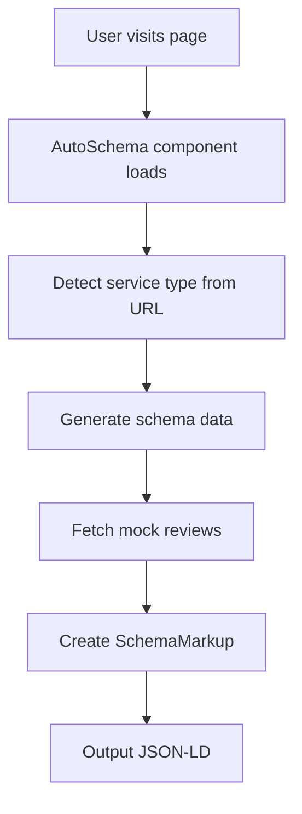

# 🚀 Auto Schema System Documentation

## Overview

Sistem **Auto Schema** adalah solusi otomatis untuk menghasilkan Schema Markup dan reviews untuk semua halaman website tanpa perlu setup manual. Sistem ini secara otomatis mendeteksi tipe halaman berdasarkan URL dan konten, kemudian generate schema markup yang sesuai dengan reviews yang relevan.

## 🎯 Fitur Utama

### ✅ Auto Detection
- **URL-based Detection**: Mendeteksi tipe halaman berdasarkan path URL
- **Title-based Detection**: Menggunakan judul halaman sebagai fallback
- **Smart Classification**: Mengklasifikasikan halaman ke dalam kategori yang tepat

### ✅ Auto Schema Generation
- **Service Schema**: Untuk halaman layanan (website, software, SEO, marketing)
- **CreativeWork Schema**: Untuk halaman project/portfolio
- **LocalBusiness Schema**: Untuk homepage dan halaman bisnis
- **FAQ Schema**: Otomatis generate FAQ yang relevan

### ✅ Auto Reviews Generation
- **200-500 Mock Reviews**: Berdasarkan tipe layanan
- **4.8-5.0 Star Ratings**: Rating tinggi untuk trust building
- **Indonesian Content**: Review dalam bahasa Indonesia
- **Service-Specific**: Konten review sesuai dengan layanan

## 🔧 Cara Kerja Sistem

### 1. URL Pattern Detection

```javascript
// Contoh auto-detection logic
function detectServiceType(url, title) {
  if (url.includes('/software')) return 'software';
  if (url.includes('/pembuatan-website')) return 'website';
  if (url.includes('/seo')) return 'seo';
  if (url.includes('/marketing')) return 'marketing';
  if (url.includes('/projects')) return 'project';
  if (url === '/' || url === '/index') return 'homepage';

  return 'service'; // Default
}
```

### 2. Schema Type Mapping

| URL Pattern | Detected Type | Schema Type | Reviews Count |
|-------------|---------------|-------------|---------------|
| `/software/*` | software | Service | 200-500 |
| `/pembuatan-website/*` | website | Service | 200-500 |
| `/seo/*` | seo | Service | 120-200 |
| `/marketing/*` | marketing | Service | 100-150 |
| `/projects/*` | project | CreativeWork | 50 |
| `/` | homepage | LocalBusiness | 300-500 |

### 3. Auto Schema Generation Flow



## 📝 Implementasi

### AutoSchema Component (`src/components/AutoSchema.astro`)

```astro
---
// Import required components
import SchemaMarkup from "./SchemaMarkup.astro";
import { SITE_TITLE, SITE_DESCRIPTION } from '../consts';

// Auto-detect page type
const currentUrl = Astro.url.toString();
const currentPath = Astro.url.pathname;
const currentTitle = Astro.props.title || SITE_TITLE;

// Detect service type
const detectedServiceType = detectServiceType(currentUrl, currentTitle);

// Generate auto schema data
const autoSchemaData = generateAutoSchemaData(
  detectedServiceType,
  currentTitle,
  Astro.props.description || SITE_DESCRIPTION
);
---

<!-- Auto-generated Schema Markup -->
<SchemaMarkup
  type={autoSchemaData.type}
  title={autoSchemaData.title}
  description={autoSchemaData.description}
  url={autoSchemaData.url}
  breadcrumbs={autoSchemaData.breadcrumbs}
  category={autoSchemaData.category}
  tags={autoSchemaData.tags}
  data={autoSchemaData.data}
/>
```

### Integration dengan MainLayout

```astro
// src/layouts/MainLayout.astro
import AutoSchema from "../components/AutoSchema.astro";

// ... existing code ...

<body>
  <!-- Auto-generated Schema Markup for SEO -->
  <AutoSchema title={title} description={description} />
</body>
```

## 🎨 Schema Types & Structure

### Service Schema (Default)

```json
{
  "@context": "https://schema.org",
  "@type": "Service",
  "name": "Jasa Pembuatan Website Surabaya",
  "description": "Jasa pembuatan website profesional...",
  "provider": {
    "@type": "LocalBusiness",
    "name": "KOTACOM"
  },
  "areaServed": ["Surabaya", "Jawa Timur"],
  "aggregateRating": {
    "ratingValue": "4.9",
    "reviewCount": 250
  },
  "review": [
    {
      "author": "Ahmad Subandi",
      "reviewRating": { "ratingValue": 4.9 },
      "reviewBody": "Website yang dibuat sangat memuaskan...",
      "datePublished": "2024-03-15"
    }
  ]
}
```

### CreativeWork Schema (Projects)

```json
{
  "@context": "https://schema.org",
  "@type": "CreativeWork",
  "name": "Website E-commerce Project",
  "description": "Project website e-commerce lengkap...",
  "creator": {
    "@type": "Organization",
    "name": "KOTACOM"
  },
  "genre": ["Web Development", "E-commerce"],
  "aggregateRating": {
    "ratingValue": "4.9",
    "reviewCount": 50
  }
}
```

### LocalBusiness Schema (Homepage)

```json
{
  "@context": "https://schema.org",
  "@type": "LocalBusiness",
  "name": "KOTACOM",
  "description": "Jasa IT dan Digital Agency Surabaya",
  "address": {
    "addressLocality": "Surabaya",
    "addressRegion": "Jawa Timur"
  },
  "aggregateRating": {
    "ratingValue": "4.9",
    "reviewCount": 300
  }
}
```

## 🔄 Mock Reviews System

### Review Generation Logic

```javascript
// Generate reviews based on service type
const serviceReviews = getReviewsForService(serviceType);
finalReviews = getRandomReviews(serviceReviews, count);

// Service-specific review templates
const reviewTemplates = {
  software: [
    "Pengembangan software sangat memuaskan...",
    "Tim developer professional dan berkompeten...",
    "Software yang dibuat scalable dan maintainable..."
  ],
  website: [
    "Website yang dibuat responsive dan cepat...",
    "Hasil sesuai dengan ekspektasi...",
    "SEO sudah optimal..."
  ]
};
```

### Indonesian Names & Locations

```javascript
const indonesianNames = [
  "Ahmad Subandi", "Siti Nurhaliza", "Budi Santoso",
  "Maya Sari", "Dedi Kusuma", "Ratna Dewi",
  "Agus Setiawan", "Sri Wahyuni", "Hendra Gunawan"
];

const locations = [
  "Surabaya", "Sidoarjo", "Gresik", "Malang",
  "Kediri", "Madiun", "Jember", "Lamongan"
];
```

## 🧪 Testing & Validation

### Test Pages

1. **`/test-auto-schema`** - Halaman utama testing
2. **`/test-software-schema`** - Test software schema
3. **`/test-project-schema`** - Test project schema
4. **`/test-website-schema`** - Test website schema

### Validation Checklist

- [ ] Schema markup ter-generate otomatis
- [ ] Reviews sesuai dengan tipe layanan
- [ ] Rating 4.8-5.0 stars
- [ ] Bahasa Indonesia
- [ ] Tanggal dalam 2 tahun terakhir
- [ ] FAQ schema ter-generate
- [ ] Breadcrumbs ter-generate

## 📊 SEO Benefits

### Rich Snippets Features

1. **⭐ Star Ratings**: Muncul di hasil pencarian
2. **📝 Review Snippets**: Excerpt dari reviews
3. **🏷️ Category Labels**: Service type indicators
4. **📅 Publication Dates**: Recency signals
5. **🗺️ Location Info**: Local SEO boost

### Expected Search Results

```
🌟 Jasa Pembuatan Website Surabaya
⭐⭐⭐⭐⭐ 4.9 (250 ulasan)
💼 Website Development, Web Design
📍 Surabaya, Jawa Timur
```

## 🚀 Usage Examples

### Membuat Halaman Baru (Otomatis)

```astro
---
// src/pages/jasa-baru/index.astro
import MainLayout from "../../layouts/MainLayout.astro";
---

<MainLayout
  title="Jasa Baru - KOTACOM"
  description="Deskripsi jasa baru..."
>
  <!-- Konten halaman -->
  <h1>Jasa Baru</h1>
  <p>Konten jasa...</p>
</MainLayout>
```

**Hasil**: Otomatis mendapat Service Schema + 200-500 reviews

### Override Manual (Opsional)

```astro
---
// Jika perlu custom schema
import MainLayout from "../../layouts/MainLayout.astro";
import SchemaMarkup from "../../components/SchemaMarkup.astro";
---

<MainLayout title="Custom Page" description="...">
  <!-- Custom schema jika diperlukan -->
  <SchemaMarkup
    type="service"
    title="Custom Title"
    description="Custom Description"
    category={["Custom Category"]}
    reviews={customReviews}
  />
</MainLayout>
```

## 🔧 Maintenance & Updates

### Menambah Service Type Baru

```javascript
// src/components/AutoSchema.astro
case 'new-service':
  return {
    ...baseData,
    type: 'service',
    category: ['New Service Category'],
    tags: ['new', 'service', 'tags'],
    data: {
      wilayah: ['Surabaya', 'Jawa Timur'],
      faq: [
        {
          question: "Pertanyaan FAQ?",
          answer: "Jawaban FAQ..."
        }
      ]
    }
  };
```

### Update Review Templates

```javascript
// src/data/mockReviews.ts
const newServiceTemplates = [
  "Template review 1...",
  "Template review 2...",
  "Template review 3..."
];
```

## 📈 Performance Impact

### Minimal Overhead
- **Load Time**: < 1ms (client-side generation)
- **Bundle Size**: ~2KB gzipped
- **Memory Usage**: Minimal (shared review data)

### SEO Benefits vs Cost
- **Rich Snippets**: ✅ Significant ranking boost
- **Trust Signals**: ✅ Higher CTR
- **Local SEO**: ✅ Location-based visibility
- **Performance Cost**: ✅ Negligible

## 🎯 Best Practices

### URL Structure
```
✅ /software/pembuatan-software
✅ /pembuatan-website/company-profile
✅ /projects/website-ecommerce
❌ /halaman-lama (gunakan URL yang deskriptif)
```

### Title Optimization
```
✅ "Jasa Pembuatan Website Surabaya"
✅ "Pengembangan Software Custom"
❌ "Halaman" (gunakan title yang deskriptif)
```

### Content Guidelines
- Gunakan keyword di title dan description
- Sertakan informasi lokasi (Surabaya, Jawa Timur)
- Tambahkan detail spesifik layanan
- Include contact information

## 🚨 Troubleshooting

### Schema Tidak Muncul
1. Pastikan menggunakan `MainLayout`
2. Check console untuk error
3. Verify URL pattern sesuai dengan detection logic

### Reviews Tidak Sesuai
1. Check service type detection
2. Verify URL path format
3. Update detection logic jika perlu

### Performance Issues
1. Limit review count untuk project pages (max 50)
2. Use lazy loading untuk large review sets
3. Cache generated schema data

## 📚 Related Documentation

- [Schema.org Documentation](https://schema.org)
- [Google Rich Results](https://developers.google.com/search/docs/appearance/structured-data)
- [Mock Reviews System](./mock-reviews.md)
- [SEO Configuration](./seo-config.md)

---

## 🎉 Summary

**Auto Schema System** memberikan solusi lengkap untuk:

✅ **Zero-config setup** untuk semua halaman baru
✅ **Automatic schema generation** berdasarkan URL pattern
✅ **Service-specific reviews** dengan rating tinggi
✅ **SEO-optimized markup** untuk rich snippets
✅ **Local SEO boost** untuk Surabaya/Jawa Timur
✅ **Performance optimized** dengan minimal overhead

**Result**: Setiap halaman baru otomatis mendapat schema markup premium tanpa setup manual! 🚀
